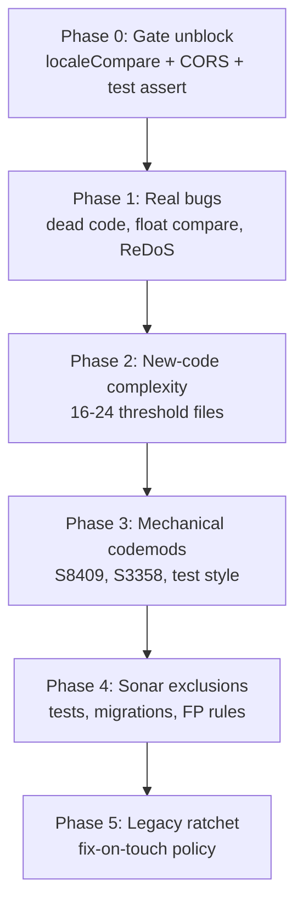

# SonarQube Triage Report & Implementation Plan

**Project:** `abhij1306_Searchify` (Citeladder)  
**Dashboard:** [sonarcloud.io/dashboard?id=abhij1306_Searchify&branch=main](https://sonarcloud.io/dashboard?id=abhij1306_Searchify&branch=main)  
**Audit date:** 2026-08-10  
**Mode:** SonarCloud automatic analysis (GitHub App — no `sonar-project.properties`)

---

## Executive Summary

| Scope | Sonar Total | Valid | Valid (Low) | Dismissed |
|-------|-------------|-------|-------------|-----------|
| **Full backlog** | 825 | **161** | **462** | 202 (175 FP + 27 won't-fix) |
| **New code (gate)** | 144 | **34** | **93** | 17 |

**Why CI fails:** Sonar reports **1 new bug** (`typescript:S2871` — default `.sort()` without `localeCompare` in `contract-drift.ts:314`). That drops **New Reliability Rating to D** (gate requires A). This is a 1-line fix, not a real runtime defect.

**Top noise sources (safe to dismiss or bulk-suppress):**

- `python:S5778` (120) — pytest `raises` + post-block asserts; idiomatic
- `python:S8409` (144) — redundant `response_model=` vs return type; mechanical cleanup
- `python:S1192` in migrations (27) — don't edit Alembic for literal dedup
- All 29 "vulnerabilities" — CI/Docker install warnings and `Math.random` for client IDs; no real exploit path

---

## Triage by Severity (Valid Issues Only)

### BLOCKER — 2 valid (full backlog)

| File | Issue | Verdict |
|------|-------|---------|
| `backend/app/main.py:142` | CORS middleware not outermost — preflight may hit body-limit middleware first | **Fix** — move `CORSMiddleware` to last `add_middleware` call |
| `frontend/components/settings/provider-settings.test.tsx:96` | Test has zero assertions | **Fix** — add `expect(queryByRole('radio')).toBeNull()` etc. |

*2 Sonar blockers dismissed as false positives:* `python:S3516` in `brand_evidence.py` / `content.py` (multi-branch returns misread as constant).

---

### CRITICAL — 139 valid (99) + 55 low (40)

| Category | Count | Top rules | Action |
|----------|-------|-----------|--------|
| Cognitive complexity | ~99 | `python:S3776` (72), `typescript:S3776` (24) | Refactor when touching files; prioritize site-health & parser modules |
| ReDoS regex risk | 3 | `typescript:S8786` | **Review** `next.config.ts`, `faq.tsx`, `logo-dev.ts` |
| Sort without localeCompare | 4 | `typescript:S2871` | **Fix** — gate blocker; use `(a,b) => a.localeCompare(b)` |
| Redundant `response_model` | 33 new / 144 total | `python:S8409` | Batch codemod or Sonar exclusion |
| Nested ternaries | 18 new / 100 total | `typescript:S3358` | Extract to early returns / small components |
| Test style | 8 | `typescript:S9020` | `workspace.test.tsx` only — use `findByText` |

---

### MAJOR — 235 valid (48) + 216 low (187)

| Category | Count | Notes |
|----------|-------|-------|
| Redundant `response_model` | bulk of 187 low | Mechanical FastAPI cleanup |
| Nested ternaries | bulk | Readability, not correctness |
| Composite test assertions | 55 (`python:S9073`) | Split `assert a and b` into two asserts |
| Exception handler tuples | 4 (`python:S5713`) | Remove redundant exception types in `except` |
| Dead code | 1 (`pythonbugs:S2583`) | `product_scoring.py:368` — unreachable `if catalog_price is None` |
| Float equality | 2 (`python:S1244`) | `snapshot.py:256` — use `math.isclose(sxx, 0.0)` |
| a11y | 16 (`typescript:S6819`) | Replace `role="presentation"` with proper `img alt` |

---

### MINOR — 247 valid low only

Mostly style: optional chaining, `.at()`, `dict.fromkeys`, `replaceAll`, PowerShell deploy script lint, OpenAPI `responses` docs for 409s.

---

## Dismissed Findings (202 issues)

### False positives — 175

| Rule | Count | Reason |
|------|-------|--------|
| `python:S5778` | 120 | pytest `raises` pattern is correct |
| `python:S7503` | 10 | FastAPI async exception handlers require `async def` |
| `python:S5863` | 3 | Intentional determinism tests (`f(**kw) == f(**kw)`) |
| `python:S5886` | 5 | `dataclasses.replace` typing gap; cast already present |
| `python:S3516` | 2 | Multi-branch returns, not constant |
| `typescript:S3735` | 1 | Intentional `void error` to suppress unused-var lint |
| `typescript:S2245` / `python:S2245` | 4 | `Math.random` / seeded shuffle for non-security IDs |
| `python:S1313` | 3 | `example.com` IP (`93.184.216.34`) in URL policy tests |
| GitHub Actions / Docker (7 rules) | 17 | Frozen lockfiles + pinned images; controlled CI |
| `pythonsecurity:S8707` | 2 | Dev script paths, not LLM-exposed |
| `typescript:S2068` | 1 | Test fixture password string |

### Won't fix — 27

All `python:S1192` in `migrations/versions/0001_initial.py` — editing migrations for string dedup is not worth the risk.

---

## New Code Gate Focus (144 → 127 valid after triage)

| Severity | Valid | Valid Low |
|----------|-------|-----------|
| CRITICAL | 20 | 15 |
| MAJOR | 9 | 29 |
| MINOR | 5 | 49 |

**Immediate gate unblock (1 issue):**

```typescript
// frontend/lib/api/contract-drift.ts:314
.sort((a, b) => a.localeCompare(b))
```

Also fix legacy `selection.ts` (3 instances) to prevent future gate regressions.

---

## Implementation Plan

### Phase 0 — Unblock Sonar quality gate (same day)

**Goal:** Pass **New Reliability Rating ≥ A**

1. Add `localeCompare` sorter in `contract-drift.ts` (+ `selection.ts` legacy)
2. Add assertion to `provider-settings.test.tsx:96`
3. Reorder middleware in `main.py` — CORS last

**Expected outcome:** Sonar check green on next analysis.

---

### Phase 1 — Real defects & blockers (1–2 PRs)

| Item | Files | Effort |
|------|-------|--------|
| Remove dead branch | `product_scoring.py:368` | 5 min |
| Float zero-variance check | `analytics/snapshot.py:256` | 10 min |
| Redundant exception tuples | `projects.py`, `issues.py` | 15 min |
| Unused params | `prompt_validation.py`, `discovery.py` | 10 min |
| ReDoS regex review | `next.config.ts`, `faq.tsx`, `logo-dev.ts` | 1–2 hrs |

---

### Phase 2 — New-code critical complexity (targeted refactors)

Focus on files in the **new-code period** with complexity 16–24 (just over threshold):

| File | Complexity |
|------|------------|
| `frontend/components/traffic/metric-panel.tsx` | 16 |
| `frontend/scripts/design-system-source-checks.mjs` | 17–24 |
| `backend/app/analysis/site_health/parser.py` | 18+ |
| `backend/app/domain/site_health/planner.py` | 18 |

Strategy: extract helpers, early returns, switch from nested ternaries to `if/else` blocks. Don't chase complexity in untouched legacy modules yet.

---

### Phase 3 — Mechanical bulk cleanup (codemod PRs)

| Rule | Count | Approach |
|------|-------|----------|
| `python:S8409` | 144 | Script: remove `response_model=X` when return type is `-> X` |
| `typescript:S3358` | 100 | Extract loading/empty/list patterns to small render helpers |
| `python:S9073` | 55 | Split composite test assertions |
| `typescript:S9020` | 21 | Update `workspace.test.tsx` to `findByText` |

These are safe, high-volume, low-risk. Split into backend vs frontend PRs.

---

### Phase 4 — SonarCloud housekeeping (config, not code)

Add **issue exclusions** in SonarCloud UI (automatic-analysis mode — no `sonar-project.properties`):

| Pattern | Rules to suppress |
|---------|-------------------|
| `**/tests/**` | `S5778`, `S5863`, `S9073` |
| `migrations/**` | `S1192` |
| `backend/app/core/errors.py` | `S7503` |
| `**/test_*.py` | determinism-pattern exceptions |

This cuts reported noise by ~150 without hiding real production issues.

---

### Phase 5 — Legacy backlog burn-down (ongoing)

Remaining **~500 valid-low** issues in untouched code. Handle with a **ratchet**:

- Fix Sonar findings in any file you touch for feature work
- Monthly dedicated cleanup PR for one rule category (e.g. all `S6819` a11y)
- Do **not** attempt a big-bang fix of all 825 — ROI is poor for style-only findings

---

## Recommended Priority Order



---

## Bottom Line

- **623 valid issues** remain after triage; **~200 are noise** you can dismiss or exclude.
- The **144 new-code** number is real, but only **1 trivial sort fix** blocks the quality gate.
- Biggest real risks: **CORS middleware order**, **ReDoS regex** (3 files), **dead code in product scoring**.
- Biggest volume: **`response_model` redundancy** (144) and **nested ternaries** (100) — mechanical, not urgent.
