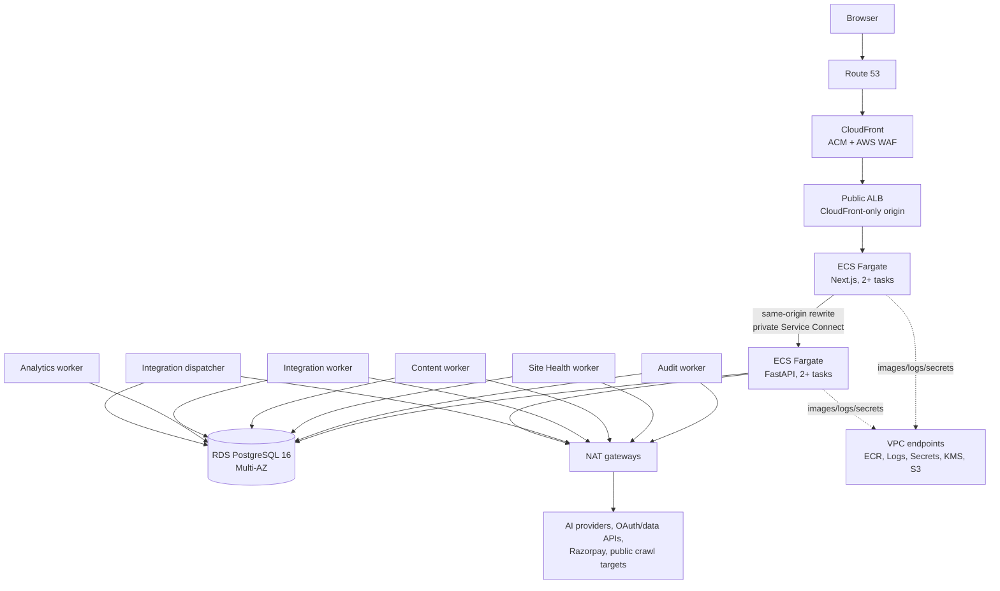

# CiteLadder AWS hosting and operations runbook

- **Primary region:** Asia Pacific (Mumbai), `ap-south-1`
- **Deployment model:** single-region, Multi-AZ
- **Application revision reviewed:**
  `7effabf91f8012982a816d807ab9df93b9aece85`
- **Security gate:**
  [Security and production-readiness audit](security-production-audit-2026-07-27.md)
- **Billing gate:**
  [Razorpay and demo owner requirements](razorpay-and-demo-owner-requirements.md)

## Status and intended use

This is the target production design and operator procedure, not a claim that
the repository can be deployed to production today. The current repository has
no AWS infrastructure as code, production frontend image, deployment workflow,
immutable post-launch migration policy, or tested recovery system. Complete the
prerequisites below before creating a public environment.

The design deliberately preserves CiteLadder's core constraints:

- browser API calls remain same-origin and pass through the Next.js rewrite;
- FastAPI is private and is never a browser-visible cross-origin endpoint;
- PostgreSQL remains the queue; no Redis is introduced;
- API and workers use the same backend image with different commands;
- workspace membership, UUID identity, encrypted BYOK data, immutable artifacts,
  and deterministic analysis remain unchanged.

## Why ECS/Fargate is the recommended target

CiteLadder needs a serverful Next.js runtime, a private FastAPI service, six
long-lived worker/dispatcher processes, PostgreSQL queue leases, outbound
provider/crawler access, and SSE/polling. ECS/Fargate provides one consistent
private network and deployment model for all of them without managing EC2.

Static S3 hosting is rejected because it cannot execute Next.js rewrites or SSR.
Lambda is a poor fit for persistent polling workers, leases, crawls, and long
provider operations. App Runner can host web services but is less natural for
the complete private multi-process topology. Amplify can host Next.js, but would
split deployment/network ownership and complicate the mandatory private proxy.

## Production prerequisites

Do not accept public traffic until all items are complete:

- [ ] Freeze `0001_initial` into explicit, immutable Alembic operations and
      adopt additive revisions for every later schema change.
- [ ] Add a root `.dockerignore` and locked, multi-stage, digest-pinned backend
      and Next.js standalone images.
- [ ] Make production frontend builds fail when `BACKEND_ORIGIN` is missing or
      loopback.
- [ ] Implement application response `Cache-Control: private, no-store` and
      verify CloudFront never caches `/api/*`.
- [ ] Implement rate/cost limits, request-size limits, safe logout/account
      switching, CSRF/origin enforcement, CSV neutralization, and browser
      security headers.
- [ ] Disable tenant custom provider endpoints in hosted production or implement
      owner-only changes, fresh key re-entry, approved-host and resolved-IP
      validation, DNS pinning, and redirect revalidation.
- [ ] Make production startup reject weak, duplicated, missing, or development
      JWT/encryption/HMAC secrets and any unapproved JWT algorithm.
- [ ] Add API liveness/readiness, worker health/heartbeat metrics, graceful
      draining, and SSE keepalives.
- [ ] Implement versioned encryption-key reads/rotation before attempting to
      rotate `ENCRYPTION_KEY`.
- [ ] Build the architecture below through reviewed IaC in separate staging and
      production AWS accounts.
- [ ] Obtain owner/legal approval for Mumbai data location, cross-region backup
      location, log retention, and third-party data flows.
- [ ] Complete deployment rollback, database/key restore, queue recovery,
      workspace isolation, and cache-isolation drills.
- [ ] Keep login OAuth and Razorpay checkout disabled until their separate gates
      pass.

## Target architecture



There is one public application origin, for example `https://app.citeladder.com`.
CloudFront sends both page and `/api/*` requests to the frontend target. The
frontend performs the existing rewrite to a stable private Service Connect
alias such as `http://api:8000`. Do **not** add a direct public API origin or
route CloudFront `/api/*` around Next.js; that would break the committed
same-origin proxy contract.

## AWS account and region layout

Use AWS Organizations with, at minimum:

| Account              | Purpose                                                                             |
| -------------------- | ----------------------------------------------------------------------------------- |
| Management           | Organization and billing only; no workloads.                                        |
| Security/log archive | Organization CloudTrail, Config/security findings, immutable log and backup copies. |
| Staging              | Synthetic data, non-live providers/billing, independent VPC/RDS/KMS/secrets/domain. |
| Production           | Customer workloads only; tightly approved deployment role.                          |

Use IAM Identity Center, phishing-resistant MFA where possible, no routine root
use, no long-lived human access keys, and break-glass credentials stored and
tested under dual control. Enable organization CloudTrail, GuardDuty, Security
Hub, AWS Config rules, ECR enhanced scanning where justified, and AWS Cost
Anomaly Detection.

Workloads run in `ap-south-1`. CloudFront is global; its ACM viewer certificate
and CloudFront-scope WAF resources are created in `us-east-1`. Any HTTPS
certificate used between CloudFront and the Mumbai ALB belongs in `ap-south-1`.

## Infrastructure as code

Use one reviewed Terraform or AWS CDK codebase with separate state/stacks per
account and environment. Do not create production resources manually except an
audited break-glass action.

IaC must own:

- VPC, subnets, route tables, endpoints, NAT, flow logs, and security groups;
- Route 53, ACM, CloudFront, WAF, origin restrictions, and response policies;
- ECR repositories, ECS cluster/task definitions/services, Service Connect,
  autoscaling constraints, log groups, and one-off migration task definition;
- RDS subnet/parameter groups, instance, encryption, backup, monitoring, and
  Secrets Manager credentials;
- KMS keys, regional Secrets Manager replicas, secret/parameter paths, IAM
  execution/task/deploy/migration roles, cross-account backup-copy grants, and
  narrowly scoped restore/decrypt roles;
- dashboards, alarms, SNS/incident destinations, log buckets, and the primary,
  cross-account, and cross-region backup vaults defined in the recovery
  contract below.

Store Terraform state in an encrypted, versioned S3 bucket with locking and
separate state access roles. Plan on pull requests; require human approval for
production apply. Prevent destroy of RDS, KMS keys, backup vaults, domains, and
production ECR through both IaC lifecycle rules and AWS deletion protection.

## Network design

Use three Availability Zones when budget permits; two is the minimum.

| Subnet tier                     | Contents                                            | Internet route                           |
| ------------------------------- | --------------------------------------------------- | ---------------------------------------- |
| Public, one per AZ              | ALB and NAT gateway only                            | Internet gateway                         |
| Private application, one per AZ | Frontend, API, workers, dispatcher, migration tasks | Per-AZ NAT for external providers/crawls |
| Isolated database, one per AZ   | RDS only                                            | None                                     |

Production ECS tasks have no public IP. Add interface endpoints for ECR API/DKR,
CloudWatch Logs, Secrets Manager, KMS, and STS where used, plus an S3 gateway
endpoint. NAT remains required because AI providers, OAuth/data APIs, Razorpay,
and arbitrary public crawl targets are outside AWS endpoints.

### Security-group contract

| Target         | Allowed inbound                                                   | Allowed outbound                                         |
| -------------- | ----------------------------------------------------------------- | -------------------------------------------------------- |
| ALB            | TCP 443 from the AWS-managed CloudFront origin-facing prefix list | Frontend SG on TCP 3000                                  |
| Frontend tasks | TCP 3000 from ALB SG                                              | API SG on TCP 8000, endpoints/DNS                        |
| API tasks      | TCP 8000 from frontend SG only                                    | RDS SG on 5432, endpoints, approved internet through NAT |
| Worker tasks   | No inbound                                                        | RDS SG, endpoints, required internet through NAT         |
| RDS            | TCP 5432 from API/worker/migration SGs only                       | Stateful responses only                                  |

Keep default network ACLs unless a tested compliance requirement needs stricter
rules; security groups and application controls are less error-prone. Enable VPC
Flow Logs to the security account with a defined retention period.

Restrict the public ALB to CloudFront twice: its security group accepts only the
origin-facing prefix list, and the listener requires a secret custom origin
header sent by CloudFront before forwarding to the frontend. The default rule
returns 403. Rotate the origin header as a secret. Evaluate CloudFront VPC
origins later, after confirming all required ALB, SSE, and deployment features.

The Site Health task role should have no application AWS permissions. Combined
with the existing private/link-local/metadata address rejection, this limits the
impact of a future SSRF bypass.

### Outbound endpoint policy

NAT and security groups do not make arbitrary HTTPS destinations safe. Hosted
production should use only the exact answer-engine endpoints in the provider
catalog unless an owner-approved gateway feature is implemented. Validate both
when a connection is written and immediately before each credential-bearing
request; block private, loopback, link-local, reserved, and metadata IPs after
DNS resolution and pin the validated address. Changing a base URL must require a
fresh API key so a member cannot redirect an existing stored key.

Keep crawler egress logically separate because Site Health deliberately visits
arbitrary public hosts. Where cost permits, route API/audit/integration/billing
egress through an AWS Network Firewall domain policy or explicit trusted proxy
limited to cataloged provider hosts, while the crawler uses its own subnet/route
policy. Application validation remains mandatory. Credential-bearing HTTP
clients must set `trust_env=False`; do not rely on the absence of `HTTP_PROXY` in
the task definition.

## DNS, TLS, and edge policy

- Route 53 aliases the application domain to CloudFront.
- ACM viewer certificate uses TLS 1.2+ policy and automatic renewal.
- CloudFront connects to the ALB over HTTPS and validates the regional origin
  certificate.
- Redirect HTTP to HTTPS at CloudFront; ALB port 80 should not be exposed.
- Add HSTS only after every production subdomain is HTTPS-ready. Start without
  `includeSubDomains`/preload, then deliberately expand.
- Apply CSP, `frame-ancestors`, `X-Content-Type-Options: nosniff`, strict
  `Referrer-Policy`, and a minimal `Permissions-Policy` through Next.js and a
  CloudFront response-header policy. Roll CSP out report-only first. The inline
  theme bootstrap must use an approved CSP hash/nonce or move to a same-origin
  external script; do not add `unsafe-inline` for convenience.

## CloudFront behaviors

Start conservatively. Optimize public marketing caching only after cache and
header tests prove it safe.

| Priority/path     | Origin       | Cache policy                                                  | Origin request policy                                                                                | Methods               |
| ----------------- | ------------ | ------------------------------------------------------------- | ---------------------------------------------------------------------------------------------------- | --------------------- |
| `/api/*`          | Frontend ALB | Managed `CachingDisabled`; all TTLs zero                      | `AllViewer` or an equivalent custom policy forwarding all cookies/query strings and required headers | All HTTP methods      |
| `/_next/static/*` | Frontend ALB | Managed `CachingOptimized`, immutable asset TTL               | No cookies; minimal headers/query                                                                    | GET, HEAD, OPTIONS    |
| `/_next/image*`   | Frontend ALB | Dedicated bounded image policy keyed on required query values | No cookies                                                                                           | GET, HEAD, OPTIONS    |
| Default `*`       | Frontend ALB | `CachingDisabled` initially                                   | Forward cookies/query required by Next.js                                                            | Normal viewer methods |

The `/api/*` behavior must preserve at least:

- the `citeladder_session` cookie and any OAuth nonce cookie;
- all query strings, including filters, pagination, SSE, OAuth, and webhook data;
- `X-Workspace-Id`, `Idempotency-Key`, `Last-Event-ID`, `Content-Type`, `Accept`,
  `Origin`, `Referer`, `Sec-Fetch-*`, Razorpay signature/event headers, and
  `X-Request-ID`.

Because caching is disabled, avoid an allowlist that silently drops a new
security-critical header. Test the exact deployed origin-request policy whenever
an API header is added.

Every authenticated backend response must also emit `Cache-Control: private,
no-store, max-age=0`. Through CloudFront, verify `Age` never grows and `x-cache`
never reports a hit for API JSON, errors, redirects, SSE, or exports.

Treat SSE as one streaming timeout contract across the complete deployed path,
not only an edge setting:

- CloudFront: set the custom-origin response/read timeout to 60 seconds and the
  response-completion timeout to at least the maximum supported stream duration
  (initially 3,600 seconds). Do not cache or compress/buffer `text/event-stream`.
- ALB: use a 75-second idle timeout and a 120-second deregistration delay. The
  timeout must reset on each data frame; target draining must not cut an active
  response before the application shutdown window.
- Next.js/Node rewrite: configure the production server with no active-response
  deadline (`requestTimeout=0`) and an upstream rewrite read/idle timeout of at
  least 75 seconds. Forward each upstream chunk immediately; disable proxy
  response buffering and any compression that batches SSE frames. If the
  generated standalone server does not expose these controls, wrap it with the
  reviewed Node server configuration rather than relying on defaults.
- FastAPI: the `StreamingResponse` has no application read deadline, yields a
  `: keepalive\n\n` comment every 10–15 seconds (target 12 seconds), emits
  `Cache-Control: private, no-store` and `X-Accel-Buffering: no`, and handles
  disconnect/cancellation without retaining the generator or database session.

Verify CloudFront alone, ALB alone, the Next.js rewrite, FastAPI, and the full
browser path with timestamped chunk captures: every hop must deliver each
keepalive within 15 seconds and must show no response buffering. Test a stream
longer than every configured idle threshold.

**Deployment drain order.** Stop new worker claims first, then let provider work
finish cooperatively at the execution boundary, then close active API/Node
streams, and only stop the task once the ALB reports the target `unused`.

`stopTimeout` is 120 seconds, and that is a **force-kill deadline, not a budget
to spend**: when it expires ECS sends `SIGKILL` regardless of in-flight work, so
the application must enforce its own drain deadline well below it — target ~90
seconds, leaving headroom for `SIGTERM` propagation and ALB deregistration.
Deregistration delay must also fit inside the same window; if the target is still
`draining` when the task dies, the ALB has connections pointed at a dead task and
clients see 5xx. Verify with a deploy under active SSE load: no request should
fail, and no stream should terminate without a clean close frame.

The client must reconnect with `Last-Event-ID` when possible, and polling remains
the authoritative recovery path after any timeout, disconnect, deploy, or missed
event.

## AWS WAF policy

Associate a CloudFront-scope web ACL and deploy rules in count mode before block:

1. AWS managed common/known-bad-input and IP reputation rules;
2. a broad per-IP request-rate ceiling;
3. tighter scoped rate rules for login, registration, provider testing, imports,
   generation, audit creation, and billing mutations;
4. request method/path allowlists for known callback and webhook routes;
5. optional Bot Control only after measuring false positives and cost.

Do not rely on WAF body inspection for upload limits; it may inspect only a
bounded prefix. The application must enforce its own streaming byte limit.

OAuth callbacks and the Razorpay webhook must not receive CAPTCHA/challenge.
Exclude them narrowly from incompatible managed rules, not from all inspection;
the application still verifies OAuth state/HMAC and the raw webhook signature.
Redact authorization/cookie/signature headers and sensitive request fields from
WAF logging/samples. Store edge logs encrypted with tightly restricted access
and lifecycle expiry; OAuth query strings must be treated as short-lived
credentials.

## Container images

Maintain two ECR repositories, one for frontend and one for backend. Enable tag
immutability, KMS encryption, lifecycle retention, and scan-on-push/enhanced
scanning. Deploy image digests, never mutable `latest` tags.

### Backend image requirements

- Multi-stage build pinned to a reviewed Python 3.12 slim digest.
- Copy `pyproject.toml` and `uv.lock`; install with `uv sync --frozen --no-dev`
  or an equivalently locked wheelhouse.
- Build native dependencies in a builder; omit compiler/header packages from
  runtime.
- Copy only application and migration files through a root `.dockerignore`.
- Run as the existing unprivileged UID; enable read-only root filesystem and a
  bounded writable `/tmp` if tests permit.
- Include the RDS CA bundle and verify PostgreSQL TLS.
- Emit build revision/SBOM metadata without embedding secrets.

### Frontend image requirements

- Multi-stage Node build using the repository's pinned `pnpm@11.9.0` only.
- `pnpm install --frozen-lockfile`, test/build, and Next.js
  `output: 'standalone'`.
- Copy only the standalone server, static assets, and public assets into the
  non-root runtime image.
- Use a stable Service Connect alias such as `http://api:8000` for
  `BACKEND_ORIGIN` across staging and production, or replace the static rewrite
  with a safely runtime-resolved proxy. Fail a production build on missing or
  loopback origin.
- Add an unauthenticated frontend liveness route that performs no dependency
  work; readiness may verify only what is required to serve/proxy traffic.

For both images, generate CycloneDX/SPDX SBOMs, run vulnerability and secret
scans, sign with keyless Cosign using GitHub OIDC, record provenance, and enforce
signature/digest policy during promotion.

## ECS service inventory

Use one ECS cluster per environment. Enable Container Insights selectively after
measuring cost. Use Service Connect or private Cloud Map for frontend → API;
FastAPI has no public load balancer.

| Service/task           | Container command                                 | Initial production count | Initial sizing hypothesis |
| ---------------------- | ------------------------------------------------- | -----------------------: | ------------------------- |
| Frontend               | `node server.js` from standalone output           |             2 across AZs | 0.5 vCPU / 1 GiB          |
| API                    | `uvicorn app.main:app --host 0.0.0.0 --port 8000` |             2 across AZs | 0.5 vCPU / 1 GiB          |
| Audit worker           | `python -m app.workers.audit_worker`              |                        1 | 1 vCPU / 2 GiB            |
| Site Health worker     | `python -m app.workers.site_health_worker`        |                        1 | 1 vCPU / 2 GiB            |
| Content worker         | `python -m app.workers.content_worker`            |                        1 | 0.5 vCPU / 1 GiB          |
| Analytics worker       | `python -m app.workers.analytics_worker`          |                        1 | 0.5 vCPU / 1 GiB          |
| Integration worker     | `python -m app.workers.integration_worker`        |                        1 | 0.5 vCPU / 1 GiB          |
| Integration dispatcher | `python -m app.workers.integration_dispatcher`    |                exactly 1 | 0.25 vCPU / 0.5 GiB       |
| Migration task         | `alembic upgrade head`                            |      one-off per release | 0.25 vCPU / 0.5 GiB       |

These are starting hypotheses, not capacity claims. Measure CPU, resident memory,
event-loop lag, queue age, provider latency, and database use under a
production-shaped load before launch.

Run one Uvicorn process per API task and scale tasks rather than hiding multiple
process pools inside a task. Frontend/API can autoscale on CPU plus ALB latency or
request count after load testing. Do **not** autoscale external-I/O workers yet:
their provider and per-host pacing is process-local. PostgreSQL protects claims,
not third-party rate limits.

Keep the dispatcher at one task. Configure deployment to avoid overlapping old
and new dispatchers, and accept a short scheduling gap. Preferred follow-up:
implement a `--once` tick invoked by EventBridge Scheduler with a PostgreSQL
advisory lock.

### Task hardening

- Separate execution role (pull image, write logs, fetch exact secret ARNs) from
  application task role (empty unless code calls an AWS API).
- Give each task family only its own secrets. The frontend receives no database
  or provider credential.
- Set `trust_env=False` in every credential-bearing HTTP client. If an explicit
  egress proxy is required, configure and test it as a named security control;
  never inherit ambient proxy variables.
- Use `initProcessEnabled`, non-root users, read-only roots, no privileged mode,
  no host mounts, and the smallest ephemeral storage that supports tested work.
- Send structured logs to a distinct KMS-encrypted log group per service.
- Set provider timeouts below the task `stopTimeout`; Fargate supports a bounded
  stop timeout, so leases remain the final crash-recovery mechanism.
- On SIGTERM, stop claiming, continue heartbeats for in-flight work, drain to a
  deadline, close HTTP/DB pools, then exit.
- Use process-only liveness for ECS restart decisions. Dependency-aware
  readiness may test database/schema compatibility for monitoring and traffic
  decisions, but a database outage must not trigger a fleet-wide restart storm.

## RDS PostgreSQL

Use RDS PostgreSQL 16 in isolated subnets:

- Multi-AZ instance deployment, no public access, KMS encryption, deletion
  protection, and storage autoscaling;
- gp3 storage sized from measured IOPS/throughput, not only capacity;
- `rds.force_ssl=1` and client certificate verification against the current RDS
  CA bundle;
- automated backups/PITR for 35 days in production;
- Database Insights/Performance Insights, Enhanced Monitoring, slow-query and
  PostgreSQL logs with bounded retention;
- maintenance/backup windows chosen away from expected audit peaks;
- automatic minor upgrades only under an approved/tested maintenance policy.

Create distinct roles:

| Role                 | Permission                                                     |
| -------------------- | -------------------------------------------------------------- |
| `citeladder_app`      | Required DML/sequence access only; no schema ownership or DDL. |
| `citeladder_migrator` | Schema owner/DDL; used only by the one-off migration task.     |
| Break-glass admin    | Stored separately; no application use.                         |

### Connection budget

Current defaults allow 20 connections per Python process
(`DB_POOL_SIZE=8`, `DB_MAX_OVERFLOW=12`). With two APIs and six persistent
workers that can approach 160 connections. Before deployment, make a budget such
as:

```text
sum(service desired_count × (pool_size + max_overflow))
+ one migration task
+ monitoring/maintenance reserve
< 70–80% of tested RDS max_connections
```

Set pool/overflow per service, not one oversized shared default. Alert at 60%,
page at 80%, and retain emergency headroom. Evaluate RDS Proxy only after
load-testing asyncpg, transaction behavior, prepared statements, and connection
pinning. Migration tasks should connect directly to RDS.

## Secrets, configuration, and key management

Never put secrets in task definitions, images, build arguments, GitHub secrets
when OIDC/AWS storage can avoid it, `.env` files, or CloudFormation/Terraform
outputs. Inject Secrets Manager values into ECS at task start and force a new
deployment after rotation. Use customer-managed KMS keys with narrowly scoped
decrypt grants and CloudTrail auditing.

Application startup must validate that signing/encryption/HMAC secrets contain
at least 256 bits of independent random material, are not duplicated, and are
not known defaults. Pin the approved JWT algorithm. A secret being present in
Secrets Manager does not prove it is strong.

### Secret inventory

| Setting                                                          | Consumer                                      | Store/rotation note                                                                                                     |
| ---------------------------------------------------------------- | --------------------------------------------- | ----------------------------------------------------------------------------------------------------------------------- |
| `DATABASE_URL` or DB username/password components                | API, workers; separate value for migrator     | Secrets Manager; verified TLS endpoint; rotate through an overlap/redeploy procedure.                                   |
| `JWT_SECRET_KEY`                                                 | API                                           | High-entropy secret; versioned verification is needed before rotation to avoid invalidating every session unexpectedly. |
| `ENCRYPTION_KEY`                                                 | API and workers handling BYOK/OAuth           | Restoring RDS without this key loses provider access. Do not rotate until key IDs/keyring rewrap exist.                 |
| `REFERRAL_HASH_SALT`, `ORDER_HASH_SALT`                          | analytics/integration paths                   | Treat as long-lived pseudonymization keys; version any change.                                                          |
| `DEFAULT_AGENT_API_KEY`, `MISTRAL_API_KEY`                       | API/content worker as applicable              | Separate staging/production provider projects, hard spend limits, routine rotation.                                     |
| `INTEGRATION_*_CLIENT_SECRET`                                    | API/integration worker/dispatcher as required | Separate provider apps per environment; rotate with callback and refresh tests.                                         |
| `BILLING_RAZORPAY_KEY_SECRET`, `BILLING_RAZORPAY_WEBHOOK_SECRET` | API                                           | Live values only after billing sign-off; webhook dual-secret overlap requires code/support before rotation.             |
| `LOGFIRE_TOKEN` or telemetry exporter token                      | Services that export                          | Optional; never enable until telemetry redaction is verified.                                                           |
| CloudFront origin-header secret                                  | CloudFront and ALB listener rule              | Rotate by accepting new+old briefly, update CloudFront, then remove old.                                                |

Provider BYOK values remain encrypted rows in PostgreSQL; they are not copied
individually into Secrets Manager. Backups must preserve the database and every
historical decryption-key version as one recovery set.

### Non-secret production configuration

Manage non-secrets in IaC/task environment or AppConfig/SSM Parameter Store:

- `APP_ENV=production`;
- canonical `FRONTEND_URL` and exact `FRONTEND_ORIGINS`;
- stable private `BACKEND_ORIGIN` for the frontend only;
- database pool sizes/timeouts and all worker concurrency/lease/poll knobs;
- provider endpoints/models and application usage caps;
- hosted-mode custom-endpoint policy and owner/admin authorization matrix;
- OAuth client IDs/callback bases and integration schedules;
- billing catalog/plan IDs and readiness flags;
- telemetry service/environment names.

At first launch set all `OAUTH_*_ENABLED=false`,
`BILLING_CHECKOUT_ENABLED=false`, `BILLING_RAZORPAY_LIVE_READY=false`, and
`BILLING_RAZORPAY_INTERNATIONAL_READY=false`. Enable each through its reviewed
rollout, not as part of infrastructure bootstrap.

## CI/CD and release pipeline

Use GitHub Actions OIDC to assume narrowly scoped staging/production deployment
roles. Store no AWS access key in GitHub. Protect production with required
reviewers and branch/environment rules; pin actions by full commit SHA.

### Pull-request gates

1. Backend lint/type/focused and full tests against PostgreSQL.
2. Frontend lint/type/unit/policy/build and focused browser tests.
3. Python lock and frontend production/full dependency audits.
4. `detect-secrets-hook` comparison against the reviewed baseline.
5. Alembic fresh-install and prior-revision upgrade tests.
6. Terraform/CDK formatting, validation, plan, policy, and IaC security scan.
7. Backend/frontend image builds with lock enforcement.
8. Image vulnerability/secret scan, SBOM generation, and license policy.
9. Same-origin, no-store, workspace-isolation, CSRF, upload-limit, health, and
   callback/webhook contract tests.
10. Provider egress tests covering attacker HTTPS, private/loopback/metadata IP,
    DNS rebinding, redirects, ambient proxy variables, member roles, and base-URL
    changes without fresh key entry.

### Build and promotion

1. Build once from the signed commit in a clean ephemeral runner.
2. Tag ECR images with Git SHA for discovery, but record and deploy digests.
3. Generate SBOM and provenance attestations; sign images through keyless OIDC.
4. Deploy the exact digests to staging.
5. Run migration, smoke, queue, SSE, OAuth-sandbox, and recovery checks.
6. Promote the same digests—not rebuilt images—to production after approval.

## Deployment procedure

1. Confirm incident channel/on-call coverage and review the change, migration,
   feature flags, provider-cost impact, and rollback compatibility.
2. Confirm all CI gates and signatures; record current task-definition revisions,
   image digests, schema revision, and CloudFront distribution config.
3. For a material migration, create/verify a restorable pre-change snapshot; do
   not treat the snapshot as the only rollback plan.
4. Run exactly one migration ECS task with the new backend digest and
   `citeladder_migrator` secret. Stream logs and require exit code 0.
5. Verify the Alembic revision and database readiness from a read-only check.
6. Deploy the API with ECS deployment circuit breaker and automatic rollback.
7. Deploy DB-derived analytics worker, then provider workers one service at a
   time. Keep the dispatcher non-overlapping.
8. Deploy the frontend last, after backend compatibility is confirmed.
9. Through CloudFront, smoke-test:
   - health/readiness and security headers;
   - register/login/logout and cookie attributes;
   - account A/B and workspace isolation;
   - API no-cache behavior with two sessions;
   - project/prompt/provider paths and a bounded import;
   - rejection of custom/unapproved provider destinations and ambient proxies;
   - one audit through claim → provider → artifact → analysis;
   - one crawl/content/integration/analytics job where enabled;
   - export formula safety, polling, and SSE keepalive/reconnect;
   - OAuth sandbox callback and signed billing webhook without enabling live
     checkout.
10. Compare dashboards for at least one normal peak interval. Record release
    evidence and close the change only when queues and error rates are stable.

## Rollback procedure

1. Stop promotion and disable risky feature flags/costly enqueue paths. Leave
   signed billing webhooks processing even if checkout is disabled.
2. Let ECS circuit breaker revert an unhealthy service, or deploy the recorded
   previous task-definition/image digest.
3. Roll frontend, API, and workers to mutually compatible versions; stop the
   dispatcher if it would enqueue work the old worker cannot understand.
4. Do **not** run `alembic downgrade` automatically. Production migrations must
   be expand/contract compatible. Prefer a forward fix.
5. If a schema change is destructive and cannot be forward-fixed, declare an
   incident, stop writes, quantify data loss, obtain incident-owner approval,
   and restore to a new RDS instance rather than overwriting the original.
6. Validate workspace isolation, queue leases, billing state, provider
   connections, and artifact counts before reopening traffic.
7. Preserve logs/snapshots and write the incident/change review.

## Backup, restore, and disaster recovery

### Backup policy

- RDS automated PITR: 35 days.
- Daily AWS Backup recovery point copied from the workload account's
  `ap-south-1` source vault to a Vault-Lock-protected destination vault in the
  backup/security account. A second destination vault in the approved DR region
  receives the cross-region copy at least daily after data-residency approval.
- Each destination vault uses its own customer-managed regional KMS key. IaC
  owns the vault policies, key policies, grants, retention lock, copy role, and
  lifecycle; the source AWS Backup role may only copy/encrypt into the named
  destinations and cannot delete or shorten retention.
- Monthly retained recovery points according to approved customer/legal policy.
- IaC state, ECR digests/SBOMs, configuration versions, and all historical
  application decryption keys included in the recovery inventory.
- **Secrets Manager replication is not the historical key archive.** Replication
  mirrors the *current* secret and its rotation window into the recovery region;
  it is not a retention-controlled archive, and a rotation or a deletion
  propagates to the replica. Any Fernet-encrypted BYOK ciphertext written under
  a superseded `ENCRYPTION_KEY` version becomes permanently unreadable the
  moment that version is no longer retrievable.
  Therefore maintain a **separate versioned, retention-controlled archive** of
  every application key version — an S3 archive with Object Lock and its own KMS
  key, or an encrypted offline recovery package — with retention at least as long
  as the longest ciphertext retention, and deletion gated by the same approval
  path as the vault. Replication remains useful for fast regional failover; it
  does not satisfy this requirement.
  Recovery drills must **restore and verify every retained key version**, not
  just the current one: decrypt one known ciphertext per key version and record
  the result. A drill that only exercises the current key does not prove the
  archive works. Database backup alone is not a secret recovery mechanism.
- A cross-account `BackupCopyRole` may copy only the named plans/vaults.
  A human-assumable `RecoveryOperatorRole` may start restores but cannot read
  application secrets. A separate approval-gated `RecoveryDecryptRole` may
  decrypt the destination backup key and recovery-secret key and may be assumed
  only during a recorded drill/incident. ECS recovery task roles may read only
  the exact regional secret ARNs they need; normal runtime, deploy, and
  migration roles cannot administer vaults, keys, grants, or recovery secrets.
- CloudTrail/security logs retained in the log-archive account under Object Lock
  where policy requires it.

The repository currently has no AWS IaC, so this remains an open implementation
gate rather than a claimed deployed control. The future Terraform/CDK stacks
must create the named vaults, regional KMS keys, Secrets Manager replication or
recovery package, key/vault policies, cross-account grants, and restore/decrypt
roles in both staging and production; console-created substitutes are drift.

### Initial recovery objectives requiring owner approval

| Event                                     |   Proposed RPO | Proposed RTO | Design                                                                |
| ----------------------------------------- | -------------: | -----------: | --------------------------------------------------------------------- |
| Single task/AZ failure                    |      Near zero |   15 minutes | ECS replacement and RDS Multi-AZ failover                             |
| Accidental data change within PITR window |        Minutes |    2–4 hours | Point-in-time restore to a new instance, validate, controlled cutover |
| Mumbai regional loss                      | Up to 24 hours |    4–8 hours | Cross-region backup + IaC cold recovery; manual DNS/origin cutover    |

Do not publish these as an SLA until drills demonstrate them.

### Monthly restore test

1. Select a recovery point without disclosing production values to testers.
2. Restore into isolated subnets under a unique test identifier; never overwrite
   production.
3. Assume the approval-gated recovery roles. **Three distinct keys are in play
   and each needs its own access and validation — do not treat them as one:**
   - the **destination backup-vault KMS key**, which decrypts the recovery point
     itself;
   - the **DR-region RDS KMS key**, which encrypts the *restored* instance's
     storage. `RestoreDBInstanceFromDBSnapshot`'s `KmsKeyId` names this
     resource-specific key, **not** the vault key; a restore into a region where
     that key is missing or ungranted fails even though the recovery point read
     succeeded;
   - the **regional Secrets Manager KMS key**, which decrypts the replicated
     secret material and the retained historical application-encryption key
     versions (see the archive requirement in the backup policy).

   Retrieve the regional secret and **every** retained application-encryption key
   version. Require CloudTrail evidence for **both decryption paths** — the
   vault/RDS key path and the Secrets Manager key path — plus both role
   assumptions. A drill that only evidences one path has not proven recovery.
4. Verify that the restored instance reports encryption under the DR-region RDS
   key (not the vault key), run schema/version checks, and start one isolated
   API/worker set with all outbound provider calls and billing disabled.
5. Verify row counts, random workspace/artifact relationships, encrypted BYOK
   decryptability, immutable artifact hashes, and queue consistency.
6. Measure restore and application-ready time; record achieved RPO/RTO.
7. Delete test resources through the exact validated IaC stack after evidence is
   retained and sign-off is complete.

Run a full regional recovery exercise at least twice yearly. CloudFront is
global, but the origin, database, NAT, tasks, and regional secrets must be
recreated and the distribution origin changed deliberately. The drill passes
only when IaC recreates the destination vault/key/grant/role contract, the
recovery point reads under the destination **backup-vault** key, the restored
database is encrypted under the DR-region **RDS** key, the regional Secrets
Manager material decrypts under its own **regional secrets** key via the recovery
role, CloudTrail evidences each of those key paths separately, and the isolated
API/migration/worker tasks start and complete read-only application checks.

## Observability and alerting

Keep JSON application logs and correlation IDs. Never log cookies, authorization
headers, provider keys/tokens, OAuth codes/state, webhook bodies/signatures,
customer raw evidence, or decrypted secrets. Treat ALB/CloudFront query-bearing
logs as sensitive and apply short, approved retention plus restricted access.

### Required signals

| Area          | Metrics/alarms                                                                                                          |
| ------------- | ----------------------------------------------------------------------------------------------------------------------- |
| Edge          | CloudFront/ALB request rate, 4xx/5xx, latency, WAF block/rate events, unhealthy targets, TLS/origin errors              |
| ECS           | Desired vs running tasks, deployment rollback, restart loop, CPU/memory, OOM, event-loop lag                            |
| API/auth      | p50/p95/p99 latency, status by route class, login/register failure/rate-limit counts, CSRF/host rejects                 |
| Database      | CPU, connections, free storage, IOPS/latency, deadlocks, long transactions, replica/failover events, backup failure     |
| Queue/workers | Ready depth, oldest-ready age, running/leased counts, expired leases, retries, terminal failures, last worker heartbeat |
| Providers     | 401/403, 429, timeout, retry rate, p95 latency, tokens/estimated cost, integration reauth rate                          |
| Product       | Audit/crawl/sync/content completion and p95 duration, artifact-analysis mismatch, export failures                       |
| Billing       | Webhook signature failure, duplicate/out-of-order event, checkout failure, entitlement reconciliation drift             |
| Recovery/cost | Backup/copy/restore-test failure, AWS budgets and Cost Anomaly Detection, provider budget exhaustion                    |

Create a single launch dashboard and route warning/page severities to named
destinations. Initial pages should include API 5xx/latency, no healthy frontend or
API target, RDS storage/connections, missing critical worker heartbeat, oldest
queue age above its SLO, backup failure, billing signature spike, and provider
cost ceiling. Tune thresholds using staging load rather than accepting noisy
defaults.

## Operational runbooks

### Worker backlog

1. Identify queue kind, oldest age, ready/running/failed counts, and last worker
   heartbeat.
2. Check ECS desired/running status, OOM/restarts, DB connections, lease expiry,
   and provider 401/429/timeout rates.
3. Pause new enqueues or costly feature flags if age continues to grow.
4. Reclaim only demonstrably expired leases through the existing queue logic;
   never manually mark live work complete.
5. Do not add replicas for audit/site-health/integration until distributed
   pacing exists. Prefer lowering concurrency, resolving provider rate limits,
   or draining serially.
6. Reconcile immutable artifacts and derived rows before declaring recovery.

### Secret rotation

1. Classify the secret and confirm code supports active+previous versions.
2. Create a new Secrets Manager version and test it in staging.
3. For provider/DB secrets, allow a bounded overlap; redeploy all consumers and
   verify new connections/calls.
4. For JWT, Fernet, and HMAC keys, follow the versioned read/rewrap plan. Never
   replace `ENCRYPTION_KEY` in place on existing ciphertext.
5. Disable the previous external credential, retain required internal decrypt
   material for the approved period, and audit access.
6. Run a backup restore/decrypt test after a key-management change.

### Database failover or saturation

1. Page on-call; inspect RDS events, connections, locks, long transactions, and
   application pool timeouts.
2. Pause nonessential enqueues/workers before exhausting reserved connections.
3. Let Multi-AZ failover complete; avoid mass task restarts that create a
   connection storm.
4. Confirm readiness recovers, leases are reclaimed only after expiry, and no
   duplicate immutable artifacts were written.
5. Scale RDS or change pool budgets only from measured evidence and with rollback.

### Suspected tenant-data exposure

1. Declare a security incident, preserve CloudTrail/edge/application logs and
   relevant task/image/config versions, and restrict access.
2. Disable the suspected cache behavior or route; invalidate CloudFront only
   after evidence is preserved. `/api/*` should never require invalidation when
   configured correctly.
3. Revoke affected sessions/credentials, identify users/workspaces/objects and
   exact exposure interval, and engage legal/privacy notification owners.
4. Fix and independently verify with two-session cross-workspace tests before
   reopening.

## Capacity and cost model

Use the [AWS Pricing Calculator](https://calculator.aws/) with Mumbai prices and
measured workload. Do not treat a development traffic estimate as a budget.

| Cost driver           | What changes it                                                 | Control                                                                                  |
| --------------------- | --------------------------------------------------------------- | ---------------------------------------------------------------------------------------- |
| RDS Multi-AZ          | Instance class, storage, IOPS, backup/cross-region retention    | Right-size from DB metrics; storage autoscale alarms; retention policy                   |
| Fargate               | vCPU/GiB × running seconds across two web tiers and six workers | Measure per process; schedule non-prod; controlled concurrency                           |
| NAT gateways          | Per-AZ hours and every external GB                              | VPC endpoints, compression, measured provider/crawl egress                               |
| CloudFront/ALB/WAF    | Requests, transfer, managed/Bot rules, logs                     | Cache immutable assets, sample logs, enable paid rule groups only from evidence          |
| Logs/metrics/traces   | Ingest, high-cardinality dimensions, retention                  | Redaction, sampling, metric cardinality policy, tiered retention                         |
| Backups/KMS           | Snapshot copies, cross-region GB, API requests                  | Lifecycle aligned to approved RPO/legal policy                                           |
| External AI/data APIs | Tokens/calls, retries, platform-funded generation               | Per-workspace quotas, cost ceilings, alerts; BYOK where the product contract requires it |

The largest launch fixed costs are usually Multi-AZ RDS, two-AZ always-on web
tasks, NAT gateways, and always-on workers. Staging may use Single-AZ RDS,
single web tasks, one NAT gateway, scheduled shutdown, and Fargate Spot for
recoverable tasks; production should keep Multi-AZ web/database capacity and
on-demand baseline workers. Never save cost by sharing production secrets,
databases, KMS keys, or provider apps with staging.

## Go-live sign-off

### Infrastructure and delivery

- [ ] Staging and production are separate accounts/stacks; no manual drift.
- [ ] Images are locked, scanned, signed, non-root, secret-free, and deployed by digest.
- [ ] CloudFront `/api/*` caching and direct public backend access are impossible.
- [ ] WAF is tuned; ALB accepts CloudFront only; TLS/security headers pass review.
- [ ] Migration fresh/upgrade/forward-rollback paths pass.
- [ ] ECS circuit breaker, health checks, graceful drains, and service inventory pass.

### Security and data

- [ ] Every High audit finding is closed with tests and reviewer evidence.
- [ ] Workspace isolation, CSRF, logout/account switching, upload limits, CSV,
      OAuth, webhook, and SSRF tests pass through the deployed edge.
- [ ] Stored BYOK keys cannot be redirected to an unapproved host; sensitive
      provider/integration changes require the approved workspace role.
- [ ] Secrets are unique, least-privilege, versioned where required, and recoverable.
- [ ] Retention/erasure, legal/privacy/terms/support/refund policies are approved.
- [ ] Login OAuth and live checkout remain off unless their dedicated gates pass.

### Reliability and operations

- [ ] Load and failure tests meet approved queue/API/provider SLOs.
- [ ] Dashboards, paging, on-call, incident roles, and vendor escalation exist.
- [ ] Rollback, PITR restore with encryption keys, AZ failover, and regional
      recovery have measured evidence.
- [ ] RPO/RTO, log/backup retention, budgets, and cost alerts are owner-approved.
- [ ] Final engineering, security, operations, product, and finance/legal sign-off is recorded.

## AWS reference links

- [Amazon ECS Service Connect](https://docs.aws.amazon.com/AmazonECS/latest/developerguide/service-connect.html)
- [CloudFront managed cache policies](https://docs.aws.amazon.com/AmazonCloudFront/latest/DeveloperGuide/using-managed-cache-policies.html)
- [RDS PostgreSQL Multi-AZ](https://docs.aws.amazon.com/AmazonRDS/latest/UserGuide/Concepts.MultiAZSingleStandby.html)
- [RDS for PostgreSQL SSL/TLS](https://docs.aws.amazon.com/AmazonRDS/latest/UserGuide/PostgreSQL.Concepts.General.SSL.html)
- [IAM OIDC identity providers](https://docs.aws.amazon.com/IAM/latest/UserGuide/id_roles_providers_create_oidc.html)
- [ECS deployment circuit breaker](https://docs.aws.amazon.com/AmazonECS/latest/developerguide/deployment-circuit-breaker.html)
- [AWS Backup restore testing](https://docs.aws.amazon.com/aws-backup/latest/devguide/restore-testing.html)
# ScraperAPI worker operations

Site Health acquisition can use ScraperAPI only as a server-side fallback after
the configured httpx/curl-cffi ladder. Store the credential as a dedicated
Secrets Manager value (for example `citeladder/<environment>/scraperapi-key`),
grant read access only to the worker task role, and never inject it into Vercel,
browser configuration, API responses, logs, traces, or artifacts. The API service
does not need the secret unless it also performs worker duties.

Workers require controlled NAT egress to ScraperAPI and DNS/HTTPS endpoints; keep
private databases without public ingress. Monitor per-rung request count, credits,
latency, fallback/error code, and cost. Configure server-owned ceilings for
requests, premium/render/geo options, concurrency, and per-crawl budget; alert
before credit exhaustion and make the next eligible rung fail with a redacted,
coded error once a ceiling is reached. Rotate the secret through Secrets Manager,
deploy/restart workers to load the new version, probe a disposable target, then
revoke the old key. Provenance stores the safe option set and provider request ID,
never the credential or raw response.
