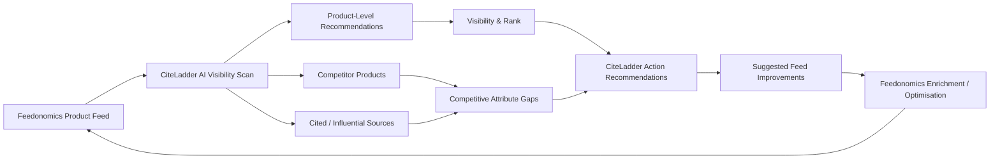
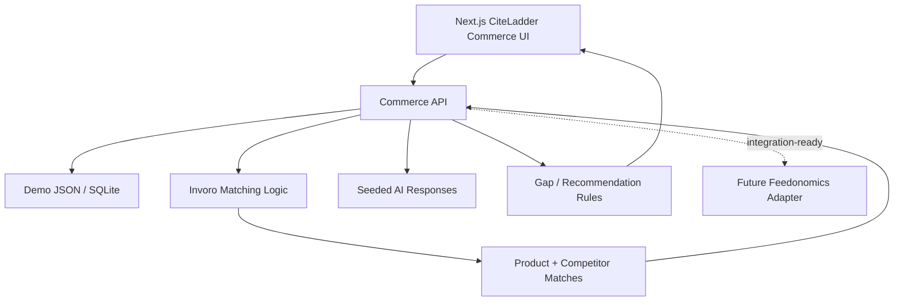
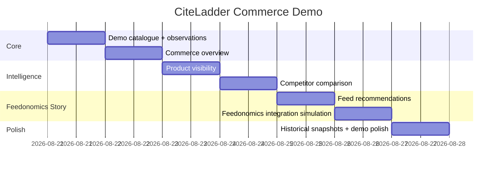

# CiteLadder Commerce Suite for Feedonomics: Demo Product Strategy and Build Specification

## Executive summary

Your elevator pitch is directionally very strong. The most important thing now is **not to turn CiteLadder into another feed-management or product-enrichment platform**. Feedonomics already has substantial capabilities for product-feed ingestion, transformation, optimisation, enrichment and syndication, and it is explicitly positioning those capabilities for agentic commerce and AI discovery. Its current public materials describe AI enrichment for titles, descriptions, categories, brands and custom attributes, plus optimisation for answer engines and distribution to AI channels such as ChatGPT, Perplexity, Gemini and Copilot. citeturn4view2turn4view3

The strongest proposition is therefore:

> **Feedonomics makes the product data AI-ready. CiteLadder tells Feedonomics whether AI is actually choosing the product — and why.**

That creates a complementary feedback loop rather than a competitive overlap.

For the Feedonomics demo, I recommend building **only four commerce capabilities**:

| Priority | Feature | What Feedonomics sees |
|---|---|---|
| **P0** | **AI Product Visibility** | Which client SKUs are recommended across AI shopping queries, by engine and prompt |
| **P0** | **Competitor Product Intelligence** | Which competing SKUs beat the client's product, plus price/attribute/positioning differences |
| **P0** | **Visibility-Driven Feed Recommendations** | Specific Feedonomics fields that should be improved based on observed competitive gaps |
| **P1** | **Product Visibility Tracking** | Whether individual products are gaining or losing AI recommendation visibility over time |

**Do not build** a sophisticated attribution platform, an autonomous feed editor, your own PIM, a full product-search crawler, a full analytics warehouse, real-time alerting infrastructure or a complex ML pipeline for the presentation. Goodie already demonstrates how broad an agentic-commerce platform can become, with SKU monitoring, feed remediation, revenue attribution, content generation, schema injection and integrations; reproducing that scope would dilute your message and greatly increase build complexity. citeturn4view0

Your existing Invoro repository gives you a considerable shortcut. It already contains product intelligence, competitor discovery and deterministic product matching; data enrichment; recurring product monitors; exports; alerts; and an API-oriented architecture. fileciteturn2file0L2-L2 Its matching code already extracts title, brand, price, currency, image, URL, SKU, MPN, GTIN, style and availability, and scores matches using identifiers, brand, title similarity, style/model signals and price. fileciteturn8file0L2-L2 Invoro discovery also already builds product queries and discovers competitor candidates rather than requiring you to invent this subsystem again. fileciteturn9file0L2-L2

The demo should therefore be a **thin CiteLadder commerce UI on top of a simple dataset and selected Invoro logic**, not a new commerce platform.

The ideal Feedonomics reaction is:

> “We already control and improve the feed. CiteLadder could tell us which products need improvement, why, and whether our changes actually increased AI visibility.”

That is the integration conversation you want.

## Strategic fit with Feedonomics

### Why this concept fits Feedonomics particularly well

Feedonomics' public product positioning has moved well beyond conventional Google Shopping feed management. It now explicitly promotes **agentic commerce**, with a workflow around standardising, enriching and synchronising product information to AI channels. citeturn0search1turn0search16

Feedonomics describes its broader data journey as ingestion → standardisation → optimisation → enrichment → syndication → protection. citeturn0search16 Its enrichment offering includes automatic categorisation, SEO/metadata optimisation, AEO optimisation and fields such as title, category, brand, description and custom attributes. citeturn4view2

That creates an obvious adjacent question:

**After Feedonomics improves a catalogue, how does the merchant know whether an AI system actually prefers those products?**

In the Feedonomics public materials reviewed for this report, the emphasis is overwhelmingly on making product information suitable for AI discovery and distributing it to AI channels. SKU-level competitive observation — “AI recommends competitor product B instead of client product A for prompt X because of attributes Y and Z” — is not prominently positioned as the centre of the product. This is an inference from Feedonomics' current public positioning rather than a claim that Feedonomics has no internal capability of this kind. citeturn0search0turn0search1turn0search17

**That gap is CiteLadder's entry point.**

### The closed loop to pitch

The relationship should look like this:



The commercial story is therefore not:

> “CiteLadder enriches ecommerce products.”

It is:

> **“CiteLadder provides the external intelligence that tells Feedonomics what to optimise next.”**

That distinction matters because generic product enrichment would overlap directly with an existing Feedonomics capability. Feedonomics already markets large-scale generative-AI enrichment and AEO optimisation. citeturn4view2

### Goodie validates the concept but also shows what not to build

Goodie's Agentic Commerce Suite is the clearest competitive validation of your idea. Goodie publicly offers SKU-level tracking across ChatGPT Shopping, Amazon Rufus, Perplexity Shopping and Google AI Mode Shopping; competitor product placement; price-mention accuracy; recommendations for missing attributes and descriptions; and revenue attribution. citeturn4view0

That is good news: **the concept is commercially legible**.

But it also means that CiteLadder should not try to win this Feedonomics conversation by saying “we can build another Goodie”.

Instead:

| Capability | Feedonomics | Goodie | Recommended CiteLadder demo |
|---|---|---|---|
| Product-feed management | **Core strength** | Integration capability | No |
| Feed transformation | **Core strength** | Some remediation | No |
| AI data enrichment | **Core capability** | Yes | Recommendations only |
| AI-shopping SKU visibility | Not prominently central in reviewed public positioning | **Yes** | **Yes** |
| Competitor SKU comparison | Not prominently central | **Yes** | **Yes** |
| Product-level visibility history | Adjacent | **Yes** | **Yes, simple snapshots** |
| Citation/source intelligence | Not core feed-management proposition | Yes | **Yes, where evidence exists** |
| Feed recommendations from observed AI outcomes | Potential strategic complement | Yes | **Yes** |
| Revenue attribution | Broader commerce stack can support performance data | **Yes** | No for demo |
| Automatic schema/storefront changes | Feedonomics handles feed transformations and syndication | **Yes** | No |
| Hundreds of thousands of SKUs | Production Feedonomics territory | Goodie claims large-scale support | No demo requirement |

Goodie itself describes the distinction between conventional feed optimisation and agentic optimisation as the difference between meeting structured platform requirements and understanding the richer completeness, consistency and contextual signals evaluated by AI systems. citeturn4view0

CiteLadder can make that distinction more compelling for Feedonomics:

> **Feedonomics owns the product-data layer. CiteLadder becomes the AI-observation and competitive-intelligence layer.**

## Recommended Commerce Suite demo

### The Commerce Overview

Do not start the demo with configuration.

Start with an executive commerce dashboard.

The first screen should immediately answer:

**“Are our products showing up when customers ask AI what to buy?”**

Suggested layout:

```text
Commerce Suite                            Brand: TrailPeak

AI Product Visibility
────────────────────────────────────────────────────

Products tracked            48
Visible in AI               31     65%
Top-3 recommendations       18     38%
Competitor wins             27
Opportunities identified    14

Visibility by AI Engine
ChatGPT         ███████████████░  72%
Gemini          ███████████░░░░  55%
Perplexity      █████████████░░  63%

Biggest opportunities
────────────────────────────────────────────────────
Alpine GTX Boot       42% visibility     ↓ Competitor wins 8 prompts
StormShell Jacket     31% visibility     Missing 3 attributes
TrailLite Backpack    77% visibility     ↑ +12% since last scan
```

The cards can all run from seeded JSON.

There is no reason to make this dynamically compute thousands of observations for the presentation.

### AI Product Visibility

This is the most important feature.

Feedonomics understands products and SKUs. CiteLadder should therefore descend from traditional brand-level AEO metrics into **SKU-level AI visibility**.

#### User question

> “Which of my client's products does AI recommend when somebody is actually trying to buy?”

#### Inputs

```json
{
  "brand": "TrailPeak",
  "products": [
    {
      "sku": "TP-ALPINE-001",
      "title": "TrailPeak Alpine GTX Hiking Boot",
      "brand": "TrailPeak",
      "price": 149.99,
      "category": "Hiking Boots",
      "attributes": {
        "waterproof": true,
        "upper_material": "Leather"
      }
    }
  ],
  "prompts": [
    "best waterproof hiking boots under $200",
    "best hiking boots for wet weather",
    "comfortable hiking boots for long trails"
  ],
  "engines": ["chatgpt", "gemini", "perplexity"]
}
```

#### Observation model

Each AI response becomes a small record:

```json
{
  "prompt_id": "waterproof-boots-under-200",
  "engine": "chatgpt",
  "observed_at": "2026-08-20T10:30:00Z",
  "recommended_products": [
    {
      "rank": 1,
      "brand": "Merrell",
      "product": "Moab 3 Mid Waterproof",
      "matched_sku": null,
      "source_type": "competitor"
    },
    {
      "rank": 3,
      "brand": "TrailPeak",
      "product": "Alpine GTX Hiking Boot",
      "matched_sku": "TP-ALPINE-001",
      "source_type": "client"
    }
  ]
}
```

#### Outputs

For every SKU, calculate:

**Visibility Rate**

\[
Visibility = \frac{\text{AI responses where product appeared}}
{\text{relevant responses}}
\]

**Top Recommendation Rate**

\[
Top3 = \frac{\text{responses where product ranks 1–3}}
{\text{relevant responses}}
\]

Also show:

- average recommendation position;
- engines where visible;
- strongest prompt;
- weakest prompt;
- primary competitors appearing alongside the SKU.

Those calculations are trivial and deterministic.

#### UI

The best UI is a product table:

| Product | Visibility | ChatGPT | Gemini | Perplexity | Avg. position | Trend |
|---|---:|---:|---:|---:|---:|---:|
| Alpine GTX | 72% | #2 | #4 | #2 | 2.7 | ↑ 8% |
| TrailLite Pack | 64% | #3 | — | #2 | 2.5 | ↑ 3% |
| StormShell | 28% | — | #5 | — | 5.0 | ↓ 11% |

Clicking one product opens the important screen:

**“Why am I losing?”**

### Competitor Product Intelligence

This is probably the most memorable feature for the Feedonomics audience because it converts vague AI visibility into something a commerce operator understands.

#### User question

> “AI recommended this competing SKU instead of ours. What does that product have that ours does not?”

That is the moment where CiteLadder becomes valuable to Feedonomics rather than merely interesting.

#### Example screen

```text
AI Recommendation Comparison

Prompt
"Best waterproof hiking boots under $200"

AI winner
Merrell Moab 3 Mid Waterproof              #1

Your product
TrailPeak Alpine GTX                       #4


                 YOUR PRODUCT       COMPETITOR

Price              $149               $160
Waterproof          ✓                  ✓
Weight              Missing            2 lb
Wide fit            Missing            Available
Arch support        Missing            Yes
Terrain             "Hiking"           Rocky / wet trails
Reviews             118                9,400+
Description         Generic            Detailed
```

Then show:

> **Why the competitor may be winning**
>
> The competing listing contains more explicit information about fit, terrain suitability, waterproofing and support — attributes repeatedly relevant to this prompt.

The word **“may”** is important. Do not pretend to have reverse-engineered an LLM's internal ranking algorithm. CiteLadder is identifying observable correlations and content gaps, not claiming causal access to model weights.

#### Reusing Invoro

This is one area where you should borrow directly from Invoro rather than start again.

Invoro already extracts standard identity and commerce fields including title, brand, price, currency, image, URL, SKU, MPN, GTIN, style code and availability. fileciteturn8file0L2-L2

More importantly, its matcher already uses a deterministic identity hierarchy involving GTIN, manufacturer/style signals, brand evidence, title similarity, model tokens and price compatibility. fileciteturn8file0L2-L2

Its product-discovery implementation builds searches from fields such as brand, title, GTIN and manufacturer identifiers and returns candidate product URLs. fileciteturn9file0L2-L2

For the demo you only need:

```python
match_product(client_product, ai_recommendation)
compare_attributes(client_product, competitor_product)
```

You do **not** need a sophisticated embedding model.

That would add latency, compute and uncertainty without making the demo substantially better.

### Visibility-driven feed recommendations

This is where the Feedonomics partnership story closes.

The feature should **not** say:

> “Generate a better description with CiteLadder.”

It should say:

> **“We found the visibility gap. Feedonomics can fix it.”**

Feedonomics already offers generative enrichment for titles, categories, brand names, descriptions and custom attributes, specifically including AEO/AI-discovery optimisation. citeturn4view2

CiteLadder therefore recommends *what* needs to change and *why*.

Example:

```text
Recommended Feed Improvements

TrailPeak Alpine GTX

AI visibility                   42%
Competitor visibility           81%

High-priority gaps

1. Add terrain suitability
   Suggested value:
   "Wet trails, rocky terrain, mixed surfaces"

   Evidence:
   Present in 4/5 higher-ranking competitor products

2. Add fit attribute
   Suggested value:
   "Standard fit; wide sizing available"

   Evidence:
   Appeared in 3 competitor descriptions for
   high-intent comfort prompts

3. Expand waterproofing description
   Current:
   "Waterproof hiking boot"

   Suggested concept:
   Explain waterproof membrane + intended weather conditions

[Review Changes]      [Send to Feedonomics]
```

The **Send to Feedonomics** button can simply open a confirmation modal in the demo.

No actual mutation needs to occur.

This is strategically much stronger than building a second enrichment workflow.

### Product visibility tracking

Your original idea of “competitor and self product-level visibility tracking” is worth keeping, but it should be extremely simple.

Store two or three snapshots:

```text
          Jul 15    Aug 1    Aug 20

Alpine      41%      52%       63%
StormShell  48%      45%       31%
TrailLite   59%      64%       72%
```

Clicking Alpine shows:

```text
+22 visibility points

Biggest gains:
"best hiking boot for rain"       +3 positions
"waterproof boots under $200"      +2 positions

New competitor:
Salomon X Ultra 5
```

That is enough to demonstrate the future value of continuous measurement.

Invoro already has recurring crawl monitors, snapshots, events, history and webhook-oriented alerts, so this concept is also technically consistent with capabilities already present in your codebase. fileciteturn2file0L2-L2

There is no reason to build the scheduler into the CiteLadder demo. Store snapshots as rows with timestamps.

## Feedonomics integration and technical architecture

### The integration story

Feedonomics has official APIs suitable for exactly the conceptual integration you need.

Its Content API can retrieve transformed, export-ready product data. The documented transformed-data endpoint accepts a database ID and export ID and supports pagination and filtering; it uses an API key plus bearer authentication. citeturn3search4

Its Event-Driven Sync API can insert or update records and is explicitly designed for near-real-time updates across channels. citeturn2search1 Feedonomics documents API-key authentication for those record updates and recommends batching roughly 50–150 records per request for throughput. citeturn3search6

Its broader Platform API can manage databases, transformers, imports, exports and schedules. citeturn2search0

So the real future workflow is completely plausible:

```text
Feedonomics
    ↓
Content API
    ↓
Current transformed products
    ↓
CiteLadder Commerce Intelligence
    ↓
AI recommendation observations
    ↓
Competitor matching
    ↓
Attribute / content gaps
    ↓
Suggested field changes
    ↓
Feedonomics Event-Driven Sync API
    ↓
Optimised feed
    ↓
AI channel
    ↓
Next CiteLadder measurement
```

### For the actual demo, fake only the transport

Do **not** delay your Codex build waiting for Feedonomics credentials.

Feedonomics says API access must be requested through FeedSupport. citeturn3search9

Create a tiny integration abstraction:

```typescript
interface CommerceCatalogProvider {
  getProducts(): Promise<Product[]>;
  updateProduct?(sku: string, changes: ProductPatch): Promise<void>;
}
```

Two implementations:

```text
DemoFeedonomicsProvider
    → reads /data/feedonomics-demo-products.json

FeedonomicsProvider
    → future real Content API / EDRTS adapter
```

Then the demo behaves exactly as the eventual integration would behave without requiring authentication or partner access.

### Sample catalogue response inside CiteLadder

Normalise Feedonomics products to this shape:

```json
{
  "sku": "TP-ALPINE-001",
  "brand": "TrailPeak",
  "title": "TrailPeak Alpine GTX Waterproof Hiking Boot",
  "description": "Waterproof hiking boot for outdoor use.",
  "price": 149.99,
  "currency": "USD",
  "availability": "in_stock",
  "product_url": "https://example.com/alpine-gtx",
  "image_url": "https://example.com/alpine.jpg",
  "category": "Hiking Boots",
  "attributes": {
    "colour": "Brown",
    "material": "Leather",
    "waterproof": true
  }
}
```

Do not model the full Feedonomics schema.

For the demo, a map of arbitrary attributes is actually preferable because Feedonomics itself handles heterogeneous product fields.

### Sample recommendation payload

Your own Commerce API can be very simple:

```http
POST /api/commerce/scans
```

```json
{
  "brand_id": "trailpeak",
  "prompt_ids": [
    "waterproof-boots",
    "long-distance-hiking"
  ],
  "engines": [
    "chatgpt",
    "gemini",
    "perplexity"
  ]
}
```

Response:

```json
{
  "scan_id": "scan_20260820_001",
  "status": "complete",
  "observations": 6,
  "products_detected": 19,
  "owned_products": 4,
  "competitor_products": 15
}
```

Then:

```http
GET /api/commerce/products/TP-ALPINE-001/intelligence
```

```json
{
  "sku": "TP-ALPINE-001",
  "visibility_score": 0.63,
  "average_rank": 2.7,
  "top_competitors": [
    {
      "brand": "Competitor A",
      "product": "Summit Waterproof Boot",
      "win_rate": 0.72
    }
  ],
  "attribute_gaps": [
    {
      "field": "terrain",
      "priority": "high",
      "competitor_coverage": 0.8
    },
    {
      "field": "fit",
      "priority": "high",
      "competitor_coverage": 0.6
    }
  ]
}
```

### “Send to Feedonomics” future write-back

The future real integration could map the recommendations into Feedonomics' Event-Driven Sync API. Feedonomics' documented record-update API supports product-record insertion/update and returns a correlation identifier for tracking asynchronous work. citeturn2search1turn3search6

Your demo can display the equivalent outbound object:

```json
{
  "sku": "TP-ALPINE-001",
  "proposed_updates": {
    "terrain": "Wet trails, rocky terrain, mixed surfaces",
    "fit": "Standard fit; wide sizing available"
  },
  "reason": {
    "visibility_gap": 0.38,
    "competitive_attribute_coverage": 0.8
  }
}
```

The button then says:

```text
✓ Recommendation prepared for Feedonomics

2 attributes
1 product
Source: CiteLadder Commerce Intelligence
```

That creates the integration moment without touching a real Feedonomics database.

### Recommended demo architecture

Keep this almost embarrassingly simple:



There is no ML infrastructure in this architecture.

### Product intelligence trade-off

For a demo there are three ways to do competitor matching:

| Approach | Accuracy | Complexity | Cost | Recommendation |
|---|---:|---:|---:|---|
| LLM decides whether two products match | Medium–high | Low | Variable | Avoid |
| Embeddings + vector DB | Medium–high | Medium | Low | Unnecessary |
| **Deterministic IDs + brand/title matching** | **High on normal retail products** | **Low** | **Near-zero** | **Use** |

Invoro already implements the third approach and uses strong identity signals such as GTIN and style/model identifiers before weaker title-based signals. fileciteturn8file0L2-L2

For the presentation, that is superior because it gives you an intuitive explanation:

```text
Matched because:
✓ Same manufacturer style code
✓ Same brand
✓ 91% title similarity
✓ Price within expected range
```

That looks more trustworthy than:

```text
AI confidence: 0.87
```

### Product intelligence compute strategy

Use a three-level strategy:

```text
Level A — Seeded observations
↓
Used for 90% of demo
Fast / predictable / free

Level B — Deterministic Invoro product matching
↓
Used live
Fast / cheap / explainable

Level C — Live AI query
↓
Run ONE during presentation if desired
Impressive but not required
```

Do not live-query 100 prompts in the meeting.

A flaky provider, rate limit or slow response should not determine whether your demo works.

## Cost, implementation effort and risks

### Demo-scale assumptions

Assume:

- 50–100 catalogue SKUs;
- 10–20 high-intent prompts;
- 3 AI engines;
- two historical snapshots;
- five to ten competitor SKUs that have detailed comparisons;
- seeded AI observations for the majority of results;
- optional live scan of one or two prompts;
- local or inexpensive cloud deployment.

These are **demo assumptions**, not production capacity claims.

### Compute and cost

| Component | Demo volume | Compute requirement | Indicative demo cost |
|---|---:|---:|---:|
| Dashboard calculations | <100 SKUs | Negligible | ~$0 |
| Visibility scoring | <100 products × observations | Negligible | ~$0 |
| Deterministic matching | Hundreds of candidates | Negligible CPU | ~$0 |
| Seeded AI responses | 30–60 stored observations | None | ~$0 |
| Live AI requests | 3–10 calls | External API | A few dollars or less in most reasonable configurations |
| Competitor product crawling | 5–20 URLs live | 2–4 CPU cores adequate | Minimal |
| Database | SQLite/Postgres | Tiny | ~$0–20/month |
| Frontend/API hosting | Demo traffic | Small instance | ~$0–50/month |

These are deliberately broad engineering estimates because the final cost depends on which AI/search APIs you choose, their model tier, response size and whether web/search tooling is billed separately.

The important product decision is that **CiteLadder's analytics layer itself is cheap**.

The expensive part of a future production product would be repeatedly collecting fresh observations from external AI engines across large prompt × region × model × product matrices.

For example:

\[
1000 \text{ prompts}
\times
5 \text{ models}
\times
7 \text{ days}
=
35,000 \text{ AI observations/week}
\]

That is the scaling problem.

It is irrelevant for this demo.

### Browser crawling trade-off

Invoro is already designed around a sensible cost hierarchy: HTTP-first acquisition, escalating to Playwright/Patchright only when a site requires rendering or browser behaviour, followed by deterministic extraction and optional LLM gap-filling. fileciteturn2file0L2-L2

Keep that philosophy.

For your presentation:

```text
Public structured data
     ↓
Normal HTTP
     ↓ only if necessary
Browser
```

Avoid:

```text
Browser everything
```

It adds latency and makes the demo fragile.

### Build effort with Codex

A realistic build target is approximately **five focused development days**, assuming the core CiteLadder project already exists.

| Work | Effort |
|---|---:|
| Commerce data model + seeded fixtures | 0.5 day |
| Commerce overview dashboard | 0.75 day |
| Product visibility table + detail | 1 day |
| Competitor comparison | 1 day |
| Recommendation / Feedonomics action screen | 0.75 day |
| Historical visibility graph | 0.5 day |
| Demo polish + sample data | 0.5 day |

Do not spend this time on authentication, billing, worker infrastructure, distributed crawling, queues or multi-tenant architecture.

### Security for this demo

Keep the security story equally straightforward.

Feedonomics APIs use authenticated access, including API-key and bearer mechanisms depending on the API. citeturn3search4turn3search6

For the demo:

- use fictitious catalogue data;
- keep all provider/API keys server-side;
- never expose keys to browser JavaScript;
- do not connect to a customer's live Feedonomics database;
- label Feedonomics write-back as a simulated integration;
- store only public competitor product information.

Invoro's own README already notes the need to respect target-site terms, robots directives, rate limits, privacy law, copyright and permission when crawling at scale. fileciteturn2file0L2-L2

That is sufficient for this stage.

Do not claim that the demo itself is SOC 2 compliant or production-ready.

### Principal demo risks

| Risk | Likelihood | Impact | Simple mitigation |
|---|---:|---:|---|
| Live AI output differs from seeded story | High | High | Seed primary demo; run only one optional live query |
| Product names differ slightly across engines | High | Medium | Invoro deterministic matching |
| Competitor matching is ambiguous | Medium | Medium | Show match reason and confidence |
| AI does not provide source citations | Medium | Low | Show source analysis only when evidence is available |
| Feedonomics API access unavailable | High | Low | Mock adapter |
| Too many features confuse the pitch | High | High | Four-feature limit |
| Enrichment sounds competitive with Feedonomics | Medium | High | Call it **Feed Recommendation**, not enrichment |
| Recommendations overstate causality | Medium | High | Use “observed gap” / “may contribute”, not “AI ranked this because…” |
| Live crawling fails | Medium | Medium | Pre-cache five competitor products |
| UI looks like generic AEO software | Medium | High | Make SKU, product, feed field and competitor product central everywhere |

The biggest strategic risk is the seventh one.

**Do not present CiteLadder as a better enrichment engine than Feedonomics.**

Present it as the intelligence system that makes their enrichment more targeted and measurable.

## Demo roadmap and success metrics

### What to build now

The current date is **20 August 2026**, so the Q2 2026 period from your original brief has already passed. I therefore interpret “MVP / Q2 / Q3+” as product stages rather than literal 2026 calendar quarters.

For the actual Feedonomics meeting:



### Demo MVP

Build:

**Commerce Overview → Product Visibility → Competitor Comparison → Feed Recommendation → Simulated Feedonomics Action.**

That is the product.

Everything else is optional.

### Next phase if Feedonomics is interested

Only after they engage, discuss:

- real Content API catalogue ingestion;
- scheduled visibility scans;
- more engines and shopping surfaces;
- automatic competitor discovery;
- real Feedonomics write-back;
- per-client workspaces;
- custom prompt libraries;
- change measurement after Feedonomics enrichment.

Feedonomics' Content API already makes transformed-data ingestion plausible, while its Event-Driven Sync API creates a natural future route for write-back. citeturn3search4turn3search6

### Later

Only after product-market validation consider:

- tens or hundreds of thousands of SKUs;
- regional model testing;
- automatic prompt discovery;
- experimentation / before-after measurement;
- AI referral analytics;
- SKU-level revenue attribution;
- source-authority modelling;
- automated Feedonomics optimisation loops.

Goodie's breadth — SKU visibility, optimisation actions, direct feed changes and revenue attribution — demonstrates that these can eventually become a substantial product category, but there is no reason to build the entire category before validating the Feedonomics partnership idea. citeturn4view0

### Metrics worth showing in the app

Avoid fifteen analytics metrics.

Use six.

| KPI | Meaning | Why Feedonomics should care |
|---|---|---|
| **Product Visibility Rate** | % relevant AI answers mentioning the SKU | Measures whether feed/product work translates into discovery |
| **Top-3 Recommendation Rate** | % queries where SKU appears in top 3 | Represents meaningful competitive visibility |
| **Average Recommendation Position** | Mean product rank | Easy before/after measurement |
| **Competitive Win Rate** | % head-to-head prompts your SKU beats competitors | Commerce-friendly competitive metric |
| **Attribute Gap Count** | High-impact missing/different attributes | Direct input to feed optimisation |
| **Visibility Delta** | Change between scans | Shows whether optimisation worked |

The most interesting metric for a partnership is eventually:

\[
\textbf{Feed Action Lift}
=
Visibility_{after}
-
Visibility_{before}
\]

Example:

```text
Feedonomics optimisation applied
August 3

AI visibility before     41%
AI visibility after      63%

Measured lift           +22 pts
```

That single chart explains why the two companies belong together.

## Positioning and presentation narrative

### Slightly sharpened elevator pitch

Your version:

> “CiteLadder is an AI visibility and competitive intelligence platform that shows brands not just how they rank in search, but how and why they get recommended across AI engines. For Feedonomics, the Commerce Suite takes this down to the product level—tracking which products and competitors AI recommends for high-intent shopping queries, why competitors win, which sources influence those recommendations, and what product/content changes can improve visibility.”

I would preserve it almost entirely, but make the Feedonomics complement explicit:

> **CiteLadder is an AI visibility and competitive intelligence platform that shows brands how and why they get recommended across AI engines. For Feedonomics, our Commerce Suite takes this intelligence to the SKU level: we track which products AI recommends for high-intent shopping queries, which competitor products win instead, what product and source signals separate them, and which feed attributes present the biggest visibility opportunities. Feedonomics can then use that intelligence to optimise the catalogue — and CiteLadder measures whether those changes improve AI visibility.**

The last sentence is the important addition.

### The single sentence to remember

When they ask:

**“Why would Feedonomics integrate this rather than build it?”**

Your answer should be:

> **“Feedonomics already has the best place to make the change; CiteLadder gives you an independent measurement layer that tells you which change matters and whether it worked.”**

### Recommended five-minute demo narrative

**Start with the business problem.**

> “Feedonomics can make a catalogue extremely rich and AI-ready. But when a shopper asks an AI engine what to buy, we still need to know which SKU actually wins.”

Open **Commerce Overview**.

> “Here we are tracking 48 products for one Feedonomics client across high-intent shopping prompts.”

Click one poorly performing product.

> “This product has 42% visibility. But one competitor appears 81% of the time.”

Open **Competitor Comparison**.

> “Rather than giving the client another generic visibility score, CiteLadder matches the actual competitor SKU and compares the product information.”

Show missing terrain, fit, materials etc.

> “Now we can tell the commerce team exactly where the product-data gap exists.”

Open **Feed Recommendations**.

> “These become structured recommendations that Feedonomics can act on.”

Click **Send to Feedonomics**.

> “The long-term integration is a closed loop: Feedonomics improves the feed, CiteLadder re-measures the AI engines, and together we can tell the client whether the change actually improved product visibility.”

Open the visibility trend.

> “That changes the relationship from feed maintenance to continuous AI-commerce optimisation.”

Stop.

Do not show infrastructure.

Do not explain queues.

Do not explain scraping.

Do not explain LLM matching.

Do not show 25 menus.

### The four navigation items I would actually put in the app

```text
CiteLadder

Overview
AI Visibility
Competitors
Feed Opportunities
```

Not:

```text
Commerce Suite
  Catalogue
  Catalogue Groups
  Scan Configuration
  Prompt Builder
  Engines
  Observations
  Crawls
  Enrichment Jobs
  Monitors
  Events
  Notifications
  Integrations
  ...
```

You are pitching a **new intelligence capability**, not demonstrating that Codex can generate enterprise navigation.

### Final product thesis

Feedonomics already has the machinery to ingest, transform, enrich, optimise and distribute product data, including explicit AI/AEO use cases. citeturn4view2turn0search16 Its developer platform also exposes credible future integration surfaces for reading transformed data and updating records. citeturn3search4turn3search6

Goodie validates that SKU-level AI-shopping visibility, competitor products and optimisation recommendations are emerging as a distinct commerce-intelligence category. citeturn4view0

And Invoro already gives CiteLadder much of the low-level product intelligence needed to make a convincing prototype: deterministic extraction, product discovery, matching, enrichment and monitoring. fileciteturn2file0L2-L2 fileciteturn8file0L2-L2 fileciteturn9file0L2-L2

So the correct product is **not** a large Commerce Suite.

It is a very focused feedback loop:

> **Observe AI recommendations → identify the competing SKU → explain the product-data gap → recommend a Feedonomics action → re-measure visibility.**

That is simple enough to build convincingly with Codex, differentiated enough to make the Feedonomics conversation interesting, and close enough to Feedonomics' existing strategic direction around agentic commerce that an integration story should feel natural rather than forced.