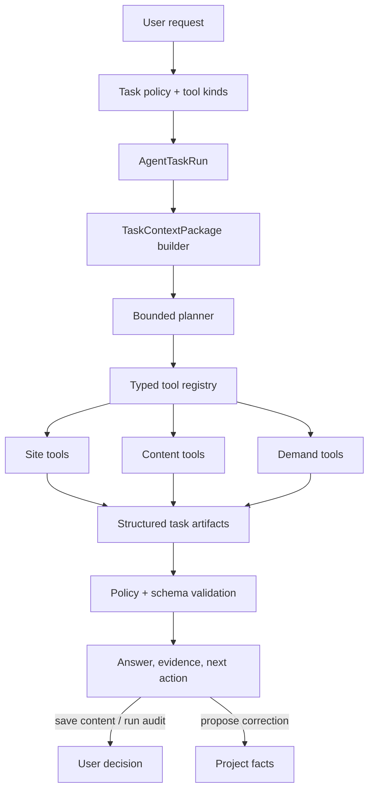

# Growth Agent and Selective Context

> **Status:** canonical plan; G0-G5 shipped in Branch 4.
>
> **Parent architecture:** [`growth-intelligence-platform.md`](growth-intelligence-platform.md).
>
> **Outcome:** give each project a provider-neutral, evidence-grounded Growth Agent that explains,
> plans, and executes bounded tasks across Site, Content, and Demand Intelligence using only
> relevant context — stopping only at the two user decisions, and nowhere else.

## 1. Product role

The Growth Agent is the fourth layer of the product and the surface the user spends the most time
in. It owns no data. It can:

- explain reports, findings, signals, and changes with source references;
- present a prioritized roadmap from the three layers' own outputs (§5.4);
- propose corrections to derived project facts, which the user accepts inline;
- create briefs, drafts, demand analyses, and prompt candidates through typed tools;
- compare compatible snapshots and name what evidence is unavailable;
- guide the user to the next action.

It cannot:

- query another workspace or bypass domain authorization;
- crawl, sync, measure, or mutate external systems outside typed authorized tools;
- start a paid or external task, or save content, without the corresponding user decision (§5.3);
- treat raw chat or its own summary as company truth;
- compute or reorder a headline metric, score, or priority (§5.4);
- overwrite a correction;
- run an unbounded autonomous loop.

## 2. Shipped foundation

Reuse and deepen:

- provider-neutral `ModelGateway` with native OpenAI Responses, OpenAI-compatible, and fake adapters;
- `core/config/agent.py` settings and abuse controls;
- the Site-owned inline `Correction` proposal/accept/withdraw path; obsolete
  `BrandProfileSuggestion` persistence and promotion are removed;
- the curated `BrandProfile` compatibility editor and Site project-facts surface;
- prompt-generation JSON parsing, validation, and evidence;
- content generation queue and immutable attempts;
- existing domain APIs for Site Health, Content, Integrations, Prompts, Opportunities, and
  Visibility.

`DefaultAgentClient` remains an adapter, not a domain service. Task planning, authorization,
context, tool execution, and persistence live under `domain/agent`.

## 3. Architecture



Specialists are bounded analyzers owned by their domains, not independent agents with private
state. Initial specialists:

- Site Entity and Assertion Analyzer;
- Page Role and Relevance Classifier;
- Schema and Consistency Analyzer;
- Journey Analyzer;
- Content Portfolio and Gap Analyzer;
- Brief Builder and Content Generator;
- Demand Mapper and Prompt Strategist;
- Snapshot Comparator and Roadmap Builder.

## 4. `AgentTaskRun`

Every substantial request becomes a durable task run with:

- workspace, project, user, conversation, and parent-run identity;
- task type, objective, requested outputs, and task-policy version;
- allowed tool set and explicit resource scope;
- frozen industry-pack version;
- context-package ID and hash;
- provider, model, capability, and instruction/skill versions;
- bounded plan, step states, tool inputs and outputs, errors, and retry history;
- result artifact IDs, validation, usage, latency, and final status;
- user decisions requested and taken.

States:

```text
draft -> validating -> queued -> planning -> running
running -> awaiting_user   -> running     (a save_content or run_audit decision)
running -> awaiting_task   -> running     (a long-running child crawl, sync, or audit)
running -> completed | partially_completed | failed | cancelled
```

`awaiting_task` is separate from `awaiting_user` on purpose: one is blocked on a person and one is
blocked on a queue, and they need different lease, heartbeat, and timeout policy. Collapsing both
into `running` leaves that policy undefined for the hour-long case.

Use the shared Postgres queue where work crosses a provider or a long-running domain task. Short
read-only explanation may run synchronously within config-owned budgets. Never hold a database
transaction over a provider or tool call.

## 5. Task and tool contracts

### 5.1 Bounded task catalog

- explain a selected artifact or report;
- summarize evidence and limitations;
- build a prioritized roadmap (§5.4);
- propose a correction to a derived project fact;
- create a content brief from an opportunity;
- generate or revise a draft from a brief;
- create or reprioritize prompt candidates;
- compare Site, Content, Demand, or Visibility snapshots;
- recommend the next measurement or evidence action.

FAQ content is one worked example of the brief-and-draft tasks, not a separate task family and not
a required first step.

The agent cannot invent a new privileged task at runtime. New task families require a config
policy, input/output schema, allowed tools, tool kinds, context policy, and eval fixtures.

### 5.2 Typed tools

A tool is a narrow domain interface, not an HTTP-shaped escape hatch. Each declares:

- name, version, and owning domain;
- strict input and output schema;
- tool kind (§5.3);
- workspace, project, and resource authorization;
- idempotency behaviour;
- required context artifacts and maximum result size;
- timeout, error codes, and retry class;
- audit fields.

The agent never receives raw database or arbitrary URL access. Domain services own business rules.
Tool results are bounded projection DTOs carrying evidence IDs.

### 5.3 The two decisions

There are no approval classes. Every tool is one of three kinds:

| Kind | Behaviour |
|---|---|
| `automatic` | Runs without asking. All reads, all analysis, all derivation: explain, compare, detect, prioritize, build a brief, propose a correction. |
| `save_content` | Produces or keeps a durable content artifact. The user edits and saves. |
| `run_audit` | Spends money or hits an external system: crawl, sync, answer-engine audit, or a schedule that does any of those. The user starts it or sets its cadence. |

A tool declares its kind in the registry. `save_content` and `run_audit` are server-enforced state
transitions, not wording in a prompt. `automatic` tools need no gate because they produce
recomputable projections over immutable evidence and record exactly what produced them.

The agent may **propose** a correction to a derived fact; the correction becomes durable only when
the user accepts it in the fact's own surface. That is an edit, not an approval queue — it happens
where the fact is displayed, not in a separate inbox.

### 5.4 Roadmaps: the agent presents priority, it does not set it

A roadmap is an ordering, so "the agent builds a roadmap" and "a model never sets a score" only
coexist if the artifact is defined precisely:

```text
RoadmapView = deterministic ordering from the priority formula
            + agent-authored grouping, sequencing rationale, and narrative
```

The priority formula owns rank. The agent owns explanation: which items belong together, why this
one comes first, what it depends on, what evidence is missing.

If the agent has grounds to reorder, it emits a `PriorityOverrideProposal` — a separate, visible,
reversible artifact carrying its reasoning and evidence. It is never a silent mutation of the
score, and the deterministic order stays inspectable beside it. Without this split the agent
becomes the ranking function through the back door while the invariant forbidding it stays
formally intact.

## 6. Context architecture

### 6.1 Context layers

A `TaskContextPackage` may contain:

- task instructions and selected skill;
- corrections relevant to the task;
- relevant project facts with confidence and limitations;
- bounded immutable evidence excerpts;
- selected Site, Content, Demand, and Visibility snapshots;
- contradictions, unavailable data, and prohibited assertions;
- output schema and validation policy.

It never contains another project, provider credentials, raw OAuth data, unbounded HTML, the entire
catalog, or the whole conversation by default.

### 6.2 Selection pipeline

1. authorize workspace, project, and task scope;
2. derive required artifact types from the task policy;
3. apply entity, page, journey, topic, audience, and time filters;
4. prefer corrections, then current compatible snapshots, then direct evidence;
5. include contradictory evidence as an explicit context section;
6. optionally use embeddings to rerank already-authorized candidates;
7. enforce per-section and total budgets from config;
8. redact disallowed data;
9. freeze ordered items, omissions, versions, hashes, and policy identity;
10. validate that every referenced artifact still belongs to the authorized project.

The frozen manifest makes a package **re-inspectable**: it names exactly what went in.
Re-*deriving* the same selection bit-for-bit is required only for evaluation fixtures, where the
retrieval model and index version are pinned. A versioned semantic reranker in the path does not
invalidate a package whose manifest is complete — see [`../invariants.md`](../invariants.md) §5.

### 6.3 Context quality signals

Record eligible, selected, omitted, stale, and contradictory counts; correction versus derived
composition; token estimates and truncation per section; freshness and source coverage; retrieval
and reranker versions; post-task citation use and unsupported-output flags.

These enable context improvement without inspecting private prompt bodies.

## 7. Facts and corrections

### 7.1 There is no memory layer

Crawls, imports, audits, and model attempts persist automatically as evidence. Analysis turns
evidence into **project facts**, which are recomputable projections. There is no third "approved
memory" store and no promotion state machine — both are deleted debt
([`growth-intelligence-platform.md`](growth-intelligence-platform.md) §9).

### 7.2 Corrections

A `Correction` is a durable user override of one derived fact:

- target fact ID, typed subject, predicate, and value;
- the derived value it replaces;
- optional scope and effective dates;
- author and timestamp.

A correction survives recomputation, outranks the derived value in context selection and
generation, and can be withdrawn to restore the derived value. A crawl, import, or model output may
supersede a derived fact; none of them may overwrite a correction.

The agent may propose a correction with its evidence. Generated content is never automatically
promoted into project facts.

### 7.3 Conversation retention

Conversation messages support continuity and auditing but are never project facts. A user can turn
a message-derived value into a correction through the same inline flow. Retention and deletion
policy is config-owned and independent of the evidence required for task provenance.

## 8. Provider-neutral model gateway

Replace OpenAI-compatible assumptions in domain code with a capability-aware contract:

```text
ModelGateway
  validate_configuration()
  capabilities()
  complete_text()
  complete_structured()
  execute_tool_turn()
  normalize_usage()
  classify_error()
```

Approved adapters may include native providers and an OpenAI-compatible endpoint. Environment
configuration selects adapter, model, endpoint, credential, and non-secret options. Defaults,
timeouts, budgets, retry classes, and capability requirements live in `core/config/agent.py`.

Capabilities: structured output mode, native tool calling, context and output limits, supported
content types, streaming, usage reporting, and provider safety metadata. A task policy declares
required capabilities, and configuration fails early when the selected model cannot satisfy them.
Tool orchestration may use a normalized application loop when an adapter lacks native tool calls,
preserving the same bounded plan and validation.

Every call records provider adapter, endpoint host, exact model, request/template/skill versions,
context hash, usage, latency, finish status, and safe error. Secrets never enter snapshots or logs.

## 9. Planning and execution

The planner receives the task, allowed tool descriptions, and context manifest, and returns a
strict bounded plan:

- maximum steps and tool calls from config;
- no recursion without a declared subtask type;
- dependency order and expected artifact per step;
- a user-decision checkpoint before any `save_content` or `run_audit` step;
- terminal criteria and partial-result behaviour.

The application validates the plan against policy before execution. Each tool call is separately
authorized and idempotent. The agent may revise the remaining plan only within the original task,
scope, budgets, and tool set; the revision is persisted.

Long-running domain tasks return task IDs and the run moves to `awaiting_task`. The agent never
keeps a provider turn or database transaction open across them. Cancellation propagates
cooperatively to owned queued tasks.

## 10. Output and trust contract

Agent responses separate:

- conclusion or proposed action;
- evidence used and relevant limitations;
- derived versus corrected facts;
- artifacts created or tasks queued;
- decisions the user still needs to make;
- suggested next step.

The UI resolves citations to in-product evidence views. A citation to an artifact absent from the
context package is rejected by validation. Unsupported factual output is flagged and blocks saving.

## 11. APIs and persistence

Add canonical owners under `domain/agent` and `models/agent.py` only after reusing the shared queue
and existing connector code:

- `AgentConversation` and messages;
- `AgentTaskRun` and append-only step/tool attempt records;
- `TaskContextPackage` and bounded manifest items;
- `Correction` links to the shared knowledge owner;
- agent evaluation and result metadata.

APIs:

- create, list, and read conversations and task runs;
- submit a task with client idempotency;
- read task plan, progress, result, and evidence;
- cancel a run;
- confirm a `save_content` or `run_audit` step;
- accept or withdraw a correction;
- list supported task, tool, and model capabilities.

Streaming is optional acceleration. Polling and persisted task state remain authoritative. All APIs
require active workspace membership and return coded errors.

## 12. User experience

### Project-level Agent workspace

- task composer with supported action suggestions;
- visible current project and scope;
- plan and progress timeline for long-running work;
- structured result cards linked to Site, Content, and Demand artifacts;
- source and limitations drawer with the context summary;
- inline decision prompts stating exactly what will be spent or saved;
- conversation history without implying every message is a fact.

### Contextual actions

- Site: explain finding, map journey, build roadmap, create brief;
- Content: explain strategy, refine brief, generate or revise, compare verification;
- Demand: explain signal, create prompts, reprioritize portfolio, plan measurement;
- Project facts: propose and accept a correction.

The agent is available throughout the product but does not replace the three workspaces. Every
underlying artifact remains inspectable and operable without chat.

## 13. Evaluation and observability

Versioned, provider-independent evaluations for:

- correct tool selection and no unauthorized tool use;
- relevant context selection and exclusion of project-foreign evidence;
- evidence citation and unsupported-claim detection;
- plan boundedness, decision placement, and cancellation;
- structured output validity across supported providers;
- correction proposal quality and zero automatic fact promotion;
- Education and Commerce task correctness;
- cost, latency, context size, retries, and partial completion.

Production telemetry records safe IDs, counts, timings, versions, and error codes — not private
context or secrets. Per-workspace usage and concurrency limits are config and entitlement
controlled.

## 14. Implementation slices and gates

### G0 — Contract and gateway foundation

- inventory current agent and discovery clients and their callers;
- define task, tool-kind, context, correction, and capability contracts;
- evolve the provider gateway with a fake adapter and compatibility tests.

**Gate:** existing prompt and profile generation work through the gateway with no behaviour drift.

### G1 — Context packages

- implement task policies, artifact eligibility, structured retrieval, optional semantic rerank,
  budgets, redaction, manifests, and quality metrics;
- adapt content and prompt generation to frozen context packages.

**Gate:** fixtures prove project isolation, relevant selection, and bounded size.

### G2 — Task runs and typed tools

- add durable runs, bounded plans, the tool registry with kinds, queue integration, steps, retries,
  cancellation, and evidence-linked results;
- begin with read-only explain and compare, create-brief, and create-prompt-candidate tasks.

**Gate:** no tool executes outside its validated task policy or authorized project scope, and no
`automatic` tool spends money or leaves the system.

### G3 — Decisions and corrections

- implement the `save_content` and `run_audit` confirmations as server-enforced transitions;
- implement `Correction` with inline accept and withdraw;
- retire the `BrandProfileSuggestion` promotion path onto corrections.

**Gate:** automated tests prove that no chat, inference, generation, crawl, or sync overwrites a
correction, and that the only gated steps are the two decisions.

### G4 — Cross-domain orchestration

- add roadmap, content generation, demand analysis, prompt strategy, schedule management, and
  next-measurement tasks;
- support long-running child tasks and partial outcomes.

**Gate:** the acceptance workflow in §15 orchestrates through typed artifacts with bounded context
and exactly two user decisions.

### G5 — Product experience and rollout

- build the project Agent workspace and contextual actions;
- add evidence, context, and decision UI, capability display, usage controls, and eval dashboards;
- calibrate at least two provider adapters, or one native plus an OpenAI-compatible adapter.

**Gate:** provider changes require configuration only; task artifacts, facts, and domain data
remain unchanged and comparable.

## 15. Acceptance scenario

The user asks: "Build a roadmap to improve qualified admissions visibility."

1. create a bounded run and select the active pack;
2. assemble only relevant corrections, the current Site snapshot, the admissions journey, and the
   Demand and Visibility snapshots where they exist;
3. expose missing analytics or visibility evidence rather than invent it;
4. call typed Site and Demand roadmap tools and return the deterministic priority order with
   agent-authored grouping and rationale;
5. offer to create the highest-priority brief — which runs automatically, because building a brief
   spends nothing and leaves nothing;
6. ask the user exactly twice: once to save the generated draft, once to schedule the recurring
   audit;
7. persist results as project facts and artifacts;
8. overwrite no correction;
9. reproduce the run's context manifest and model and tool provenance later.

## 16. Verification matrix

- gateway adapter, capability, error, and usage tests;
- task-policy, planning, step-limit, tool-authorization, idempotency, queue, and cancellation tests;
- context isolation, relevance, contradiction, budget, redaction, and hash tests;
- correction durability tests: recompute, recrawl, import, and generation all leave a correction
  intact;
- tool-kind tests: every `automatic` tool is proven to make no paid or external call;
- evidence-citation and unsupported-output validation fixtures;
- frontend tests for progress, context and evidence display, decisions, accessibility, and polling
  fallback;
- end-to-end Education and Commerce agent tasks use fake providers in CI; live models are opt-in.
