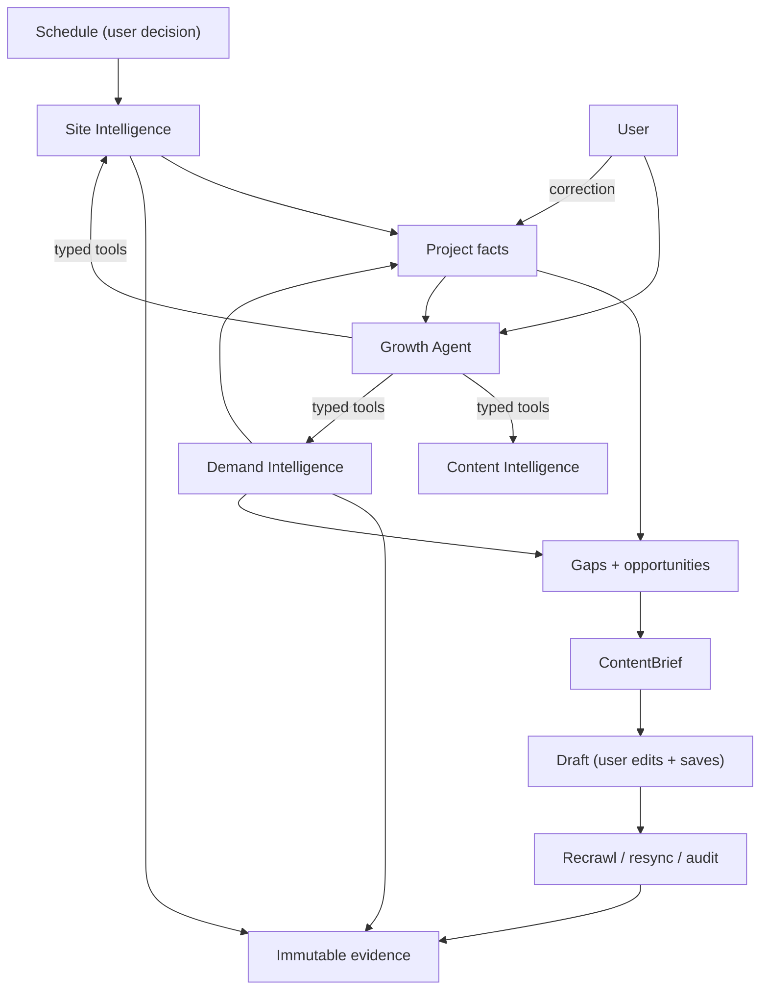
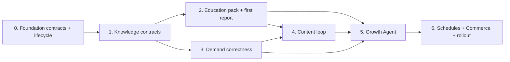

# CiteLadder Growth Intelligence Platform

> **Status:** canonical program architecture and implementation map.
>
> **Parent:** [`../architecture.md`](../architecture.md) defines the product. This document defines
> what gets built, in what order, how the layers interact, and what existing work is deleted.
>
> **Companion plans:** [`site-intelligence-primary-product.md`](site-intelligence-primary-product.md),
> [`content-intelligence.md`](content-intelligence.md),
> [`demand-intelligence.md`](demand-intelligence.md), [`growth-agent.md`](growth-agent.md),
> [`knowledge-kernel-and-industry-pack-spec.md`](knowledge-kernel-and-industry-pack-spec.md),
> [`frontend-growth-intelligence.md`](frontend-growth-intelligence.md).
>
> **This document owns delivery sequence.** No other document restates it.

## 1. Product thesis

CiteLadder answers four connected questions over one governed knowledge system:

1. What does the company currently say and prove?
2. What knowledge, content, journeys, and machine-readable evidence are missing or weak?
3. What are people demonstrably looking for and doing?
4. What should the company create, improve, and measure next?

Four layers. Three own data; the fourth is the conversation:

- **Site Intelligence** acquires the owned corpus, builds the evidence-backed knowledge model,
  evaluates page roles and journeys, and produces the first roadmap.
- **Content Intelligence** converts verified facts and prioritized gaps into strategy, briefs,
  drafts, and recrawl-based verification.
- **Demand Intelligence** combines GSC, GA4, site evidence, and answer-engine observations into
  demand signals, prompt portfolios, priorities, and outcome tracking.
- **Growth Agent** is how the user talks to the other three. It plans bounded tasks, calls typed
  tools, and assembles inspectable context. It owns no data.

## 2. The simplification that governs every plan

The system runs itself. There are exactly two human decisions:

| Decision | Scope |
|---|---|
| **Generate and save content** | Which briefs become drafts, what the draft says after editing, and whether it is kept or exported. |
| **Run and schedule audits** | When crawls, integration syncs, and answer-engine audits execute, and on what cadence. |

Everything else is automatic: crawling within a schedule, page classification, knowledge
extraction, assertion and contradiction detection, gap detection, opportunity creation and
grouping, demand signals, prompt generation, prioritization, and roadmap construction.

**Why this is safe without gates.** Every automatic output is a projection over immutable evidence
that records exactly what produced it. A wrong output is fixed by correcting the input or the rule
and recomputing. Nothing in the automatic set spends money, leaves the system, or destroys an
earlier observation. Approval gates exist for cost and for external effect — not as a substitute
for correctness.

**Corrections replace approvals.** Where a derived fact is wrong, the user corrects it. The
correction is durable, wins over later derivations, and is attributable. This inverts the friction:
the user touches the knowledge layer when something is wrong, not to bless each thing that is
right. `CorrectionRate` becomes a first-class quality metric — falling correction rate is the
honest signal that derivation is improving.

## 3. How the layers interact



The contracts between layers, stated once:

| From → To | Contract |
|---|---|
| Site → Facts | Page understanding, entities, assertions, relations, contradictions — each carrying source artifact IDs and analyzer/pack versions. |
| Site → Gaps | Role, question, journey, schema, and trust coverage compared against the active pack's expectations. |
| Demand → Facts | Normalized query, landing, event, and visibility observations joined to pages and journeys. |
| Demand → Gaps | Demand signals that raise or lower the priority of an existing gap. Demand never *creates* a content gap on its own, and its absence never fabricates low demand — it lowers coverage. |
| Gaps → Content | One `OpportunityBundle` per target and action family, which a brief consumes. Content never re-derives gaps. |
| Content → Verify | An approved draft records what it claimed; a later compatible snapshot observes whether it appeared. |
| Verify → Site/Demand | Descriptive before/after observation. Never a causal claim. |
| Any layer → Agent | Bounded projection DTOs with evidence IDs, through typed tools. The agent never reads the database directly. |

**The rule that keeps this coherent:** each arrow is one direction. Content does not write to
Site's knowledge. Demand does not write content. The agent writes nothing that a domain service
does not own.

## 4. Canonical data layers

### 4.1 Immutable evidence

Persisted automatically: crawl attempts and normalized page/document artifacts; integration import
artifacts and normalized metric rows; answer-engine raw artifacts, analyses, and citations;
generation request snapshots and append-only attempts; user actions.

Evidence may be unavailable, contradictory, or stale. Persistence means "observed", never "true".

### 4.2 Project facts

Versioned, recomputable projections: entities, relationships, claims, questions, topics, audiences,
offerings, journeys, page roles, content units, schema assertions, contradictions, gaps, demand
signals, opportunity bundles, prompt candidates, briefs, and agent plans — each with confidence,
effective dates, source coverage, analyzer versions, and limitations.

A **correction** is a typed user override on any fact. It is durable across recomputation,
outranks the derived value, records author and timestamp, and is withdrawable.

There is no third "approved memory" layer. Generated content is never automatically promoted into
project facts.

## 5. Shared artifact vocabulary

| Artifact | Purpose | Required provenance |
|---|---|---|
| `EvidenceArtifact` | Immutable observation from a crawl, integration, audit, or generation | source run/task, content hash, acquisition version |
| `PageUnderstanding` | Public DTO for the append-only `SitePageAnalysis` row: generic kind, industry role, purpose, audience, content units, disposition | artifact ID, classifier and pack versions |
| `KnowledgeEntity` | Project-scoped typed entity | evidence IDs, pack ID/version, extractor version |
| `KnowledgeAssertion` | Typed claim about an entity or relationship, including contradictions and effective dates | source spans, confidence, state, analyzer version |
| `KnowledgeRelation` | Typed connection between entities, pages, journeys, questions, prompts, and evidence | source IDs, relation version |
| `Correction` | Durable user override of a derived fact | target fact ID, author, timestamp, prior derived value |
| `JourneyDefinition` | A business journey with configured outcomes, stages, supporting pages, and events | user/pack source, version |
| `IntelligenceSnapshot` | Immutable bounded projection for one Site, Content, or Demand run | source IDs, coverage, formula versions |
| `OpportunityBundle` | Prioritized, traceable improvement for one target and action family | source snapshot/finding/signal IDs, rule and formula versions |
| `ContentBrief` | Frozen task specification: verified facts, gaps, audience, intent, constraints, sources | fact/signal/opportunity IDs, brief version and hash |
| `DemandSignal` | Time-bounded evidence of demand, behaviour, visibility, or an unmet question | integration/traffic/visibility/site IDs, window, formula version |
| `PromptCandidate` | Measurable prompt linked to audience, intent, and evidence | demand/site/fact IDs, generator and validation versions |
| `TaskContextPackage` | Bounded context frozen for one agent or generation task | selected artifact IDs, selection policy, budget, manifest hash |
| `AgentTaskRun` | Persisted bounded plan, tool calls, results, and model provenance | context package, tool versions, provider/model, policy version |
| `GrowthProgram` | Versioned schedule for recurring crawls, syncs, and audits | scope, cadence, cost limits, policy version |

Do not create a generic untyped "memory blob" that bypasses these contracts.

## 6. Industry packs

The active analysis contract:

```text
stable core + one primary industry pack + reviewed capabilities + versioned project overlay
```

This is the contract the pack validator enforces
([`EXTENSION_CONTRACT.md`](../../backend/app/core/config/industry_packs/EXTENSION_CONTRACT.md),
`capabilities.json`). Capabilities are cross-cutting modules a pack opts into; they strengthen
requirements and never weaken shared controls.

- **Education v1** — K-12 identity, admissions, academics, curriculum, faculty, boarding,
  facilities, fees, results, activities, events, compliance, parent resources, editorial content.
- **Commerce v1** — store identity, category, product detail, offers, variants, comparison, buying
  guides, policies, reviews, and product/category journeys.

Both are **validated candidates**: ready for controlled shadow evaluation, not automatically
authoritative production findings. Promotion past that tier requires classifier accuracy measured
against at least two corpora not used during pack authoring, reported separately for authoring and
held-out sets. [`EVALUATION_CONTRACT.md`](../../backend/app/core/config/industry_packs/EVALUATION_CONTRACT.md)
owns the threshold.

Composite businesses with two genuine industry identities have no composition path today; see
[`../architecture.md`](../architecture.md) §6 for the forward-compatible mechanism and why it is
deferred.

## 7. Progressive business context

Project creation requires only what is needed to start: organization name, owned domain, and
locale defaults. Onboarding is not a strategy questionnaire.

Everything else — offerings, audiences, markets, outcomes, journeys, differentiators, tone,
prohibited claims, competitors — is **derived from the corpus first** and corrected by the user
where wrong. Site Intelligence proposes; the user edits. Missing optional context reduces coverage
or confidence; it never blocks a crawl and never fabricates a default.

## 8. Analysis policy

**Deterministic ownership.** Code owns URL admission, parsing, canonicalization, exact identifiers,
schema syntax, metric aggregation, joins, lifecycle state, validation, deduplication, scoring
formulas, and hard policy gates.

**Model ownership.** Models classify nuanced intent, match differently-worded pages and questions
to pack archetypes, reconcile bounded claims, summarize evidence, create task plans, generate
prompts, and draft content. Each output persists selected evidence, context hash, provider, model,
template and analyzer versions, confidence, limitations, and deterministic validation results.

**The asymmetry rule.** A model judgement that dismisses a gap needs higher confidence than one
that detects it. A false detection produces recoverable extra work; a false dismissal silently
hides the thing the product exists to find. Thresholds are config-owned and separate.

No model output changes a headline metric, a score, or a correction.

## 9. Debt to delete

The next implementation session removes these rather than carrying them forward.

| Debt | Action |
|---|---|
| Approval classes `confirm_task`, `review_artifact`, `promote_memory`, `external_mutation` | Delete. Replace with the two decisions in §2. Nothing publishes externally, so `external_mutation` has no subject. |
| "Approved Brand Memory" as a third data layer | Delete. Project facts plus `Correction` replace it. `BrandProfile` remains only as a compatibility read model until its consumers move. |
| Memory-proposal / promotion state machines | Delete. There is no promotion; there are derivations and corrections. |
| Prompt `proposed → active` review gate | Delete. Prompts are generated and active; the user edits or removes them. Scheduling the audit is the decision. |
| FAQ-first sequencing as an architectural mandate | Delete. FAQ is one worked example of the content loop, not the required first slice. See §10. |
| `docs/plans/faq-intelligence-first-slice.md` | Archived. Its durable content — question coverage states, brief contract, validation list — is folded into [`content-intelligence.md`](content-intelligence.md). |
| Second page-analysis row (`PageUnderstanding` as a table) | Never create it. `SitePageAnalysis` becomes append-only; `PageUnderstanding` is its DTO name. |
| Composite score renormalization over observed dimensions | Delete. Full denominator plus explicit coverage. |
| "Precision" in product-facing success measures | Replace with acceptance rate. Reserve precision for held-out fixtures. |
| Duplicate delivery sequences in `architecture.md` and elsewhere | Deleted. §10 below is the only one. |
| `/issues` and `/opportunities` as standalone destinations | Fold into the owning workspace as filtered views; findings are contextual to their artifact. |

## 10. Delivery sequence

**The dependency that governs everything: project facts precede content generation.** A brief
cannot be assembled from assertions that do not exist.



| # | Stage | Contains | Done when |
|---|---|---|---|
| 0 | Foundation | Queue/lifecycle reconciliation, pack loader, `page_kind`/`industry_role` split, append-only `SitePageAnalysis` | No drained task set renders as live; pack manifests freeze on the crawl |
| 1 | Knowledge | Corpus inventory, entities, assertions, relations, contradictions, effective dates, coverage, corrections | Identical artifacts reproduce identical facts and scores |
| 2 | Education + report | Education pack activation, The Asian School inventory and snapshot, opportunity bundles, first complete report | The report answers the §1 questions with traceable evidence and no live provider call from a read endpoint |
| 3 | Demand correctness | GSC/GA4 report families, identity joins, journeys, demand signals, priorities | Signals trace to source rows and windows; unavailable ≠ zero |
| 4 | Content loop | Inventory, strategy, gap→brief→draft→validate→edit→save→verify. FAQ is the first worked example | A user goes from a gap to a saved, validated draft and sees recrawl verification |
| 5 | Growth Agent | Gateway, context packages, typed tools, task runs, agent workspace | No tool executes outside its task policy or project scope |
| 6 | Rollout | Schedules, Commerce pack, contextual agent actions, exports | Commerce introduces no second knowledge model, fetcher, queue, or content pipeline |

Frontend work tracks these stages in
[`frontend-growth-intelligence.md`](frontend-growth-intelligence.md) §10; three of its steps have
no backend dependency and can start immediately.

## 11. Program acceptance

The architecture is accepted when one project can:

1. create a project from name and domain alone;
2. acquire and classify its relevant owned corpus under a frozen industry pack;
3. produce a versioned Site Intelligence snapshot and complete report;
4. show derived project facts, and let a user correct one and see the correction survive a recrawl;
5. detect role, question, and journey gaps and group them into opportunities;
6. build a frozen evidence-grounded brief from a gap;
7. generate, automatically validate, edit, and save visible content, with unsupported claims blocked;
8. recrawl and verify what was claimed, without mutating earlier evidence;
9. import GSC/GA4 data and create traceable demand signals;
10. generate a prompt portfolio and run manual and scheduled visibility measurement without blending
    results into site truth;
11. rerun and show what changed;
12. ask the Growth Agent to explain and execute bounded tasks with a visible context manifest.

Demand acceptance item 9 and the Demand-owned portion of item 10 shipped in D0-D5: combined
Google projections, versioned journeys, immutable signals/snapshots, active prompt provenance,
frozen audit links, shared Opportunity routing, and the six-panel workspace.

## 12. Cross-plan implementation rules

- Preserve UUIDs, workspace authorization, immutable artifacts, single-writer queue behaviour,
  coded errors, same-origin APIs, and version provenance.
- Keep the modular monolith and the shared Postgres queue. Intelligence layers are modules and
  tools, not microservices.
- Extend existing owners before adding storage or queues. Site Health, Content, Integrations,
  Traffic, Analytics, Prompts, Opportunities, Schedules, and Visibility already ship useful
  foundations.
- Read APIs project persisted artifacts only.
- Configuration, catalogs, thresholds, templates, context budgets, confidence thresholds, and
  registry data live under `core/config/*` or frontend config owners.
- Schema changes fold into `0001_initial`; reset and verify a disposable database. Longitudinal
  behaviour is proven against re-ingestable fixtures, not accumulated local state.
- Every slice includes offline fixtures, deterministic validations, component tests,
  workspace-isolation tests, and an opt-in live acceptance procedure.
